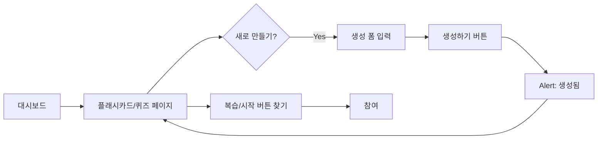

# 플래시카드 & 퀴즈 참여 기능 UX 개선 계획
## 2025년 11월 2일

---

## 📋 목차
1. [현재 상태 분석](#현재-상태-분석)
2. [글로벌 에듀테크 서비스 분석](#글로벌-에듀테크-서비스-분석)
3. [핵심 개선 전략](#핵심-개선-전략)
4. [상세 구현 계획](#상세-구현-계획)
5. [Playwright 테스트 계획](#playwright-테스트-계획)

---

## 1. 현재 상태 분석

### 1.1 기존 구현 현황

#### ✅ 완전 구현된 기능
| 기능 | 파일 | 상태 |
|------|------|------|
| 플래시카드 생성 | `app/flashcards/page.tsx` | ✅ 완료 |
| 플래시카드 복습 | `components/interactive-learning/FlashcardReview.tsx` | ✅ 완료 |
| AI 퀴즈 생성 | `app/quiz/page.tsx` | ✅ 완료 |
| 퀴즈 참여 | `components/interactive-learning/QuizView.tsx` | ✅ 완료 |
| SM-2 알고리즘 | `lib/interactive-learning/flashcard-scheduler.ts` | ✅ 완료 |
| XP 보상 시스템 | `lib/gamification/store.ts` | ✅ 완료 |

#### ❌ UX 문제점

**1. 생성 → 참여 흐름의 단절**
```
현재: 생성 완료 → alert → 페이지 그대로
개선: 생성 완료 → "바로 시작하기" CTA → 즉시 참여
```

**2. 참여 버튼의 가시성 부족**
- 플래시카드: "복습 시작하기" 버튼이 통계 카드 하단에 위치
- 퀴즈: 생성 후 바로 시작하는 흐름이 없음

**3. 빈 상태(Empty State)의 동기부여 부족**
- 현재: "오늘 복습할 카드가 없습니다" + 파티 이모지
- 개선: 새 카드 만들기 권장 + 학습 진행 상황 표시

**4. 즉시 참여 유도 부족**
- 생성 직후 momentum을 활용하지 못함
- 사용자가 다시 찾아와야 참여 가능

### 1.2 사용자 여정 맵 (현재)



**문제점:**
- F → B로 돌아간 후 다시 찾아야 함
- G 단계에서 사용자 이탈 가능성 높음

---

## 2. 글로벌 에듀테크 서비스 분석

### 2.1 Quizlet (시장 점유율 1위)

#### 핵심 UX 패턴
**1. 즉시 학습 시작 (Instant Study)**
```javascript
// 카드 세트 생성 직후
생성 완료 → 3가지 학습 모드 선택 모달
├─ 플래시카드 모드 (기본)
├─ 학습 모드 (Writing)
└─ 테스트 모드 (Quiz)
```

**2. 진행 상태 시각화**
- 원형 프로그레스 바로 숙달도 표시
- "아직 학습하지 않음" / "학습 중" / "숙달됨" 3단계
- 각 단계별 카드 개수 실시간 표시

**3. 게이미피케이션**
- 학습 스트릭 (연속 학습 일수)
- 레벨업 애니메이션
- 친구와 경쟁 리더보드

#### 적용 가능한 패턴
✅ 생성 후 즉시 학습 모드 선택 모달
✅ 시각적 진행 상태 표시 (원형 차트)
✅ 3단계 숙달도 시스템
⚠️ 소셜 기능은 Phase 2로 연기

### 2.2 Anki (최고의 SRS 시스템)

#### 핵심 UX 패턴
**1. 데크 관리 시스템**
```
├─ 데크별 분리 (수학, 영어 등)
├─ 복습 예정 카드 수 실시간 표시
├─ 오늘 학습한 새 카드 수 표시
└─ 전체 카드 수 통계
```

**2. 상세한 복습 피드백**
```
Again (0) → Hard (1) → Good (2) → Easy (3)
각 선택지마다 다음 복습 시간 표시
예: "Again: <1분", "Good: 10분", "Easy: 4일"
```

**3. 학습 히트맵 (Heatmap)**
- 달력 형태로 일별 학습량 시각화
- GitHub contributions 스타일
- 학습 연속성 동기부여

#### 적용 가능한 패턴
✅ 과목별 데크 관리 (이미 구현됨)
✅ 다음 복습 시간 미리보기 추가
✅ 학습 히트맵 추가
✅ 4단계 품질 평가 (현재 6단계를 4단계로 간소화)

### 2.3 Khan Academy (높은 완료율)

#### 핵심 UX 패턴
**1. 학습 경로 시각화 (Learning Path)**
```
[완료] → [현재] → [잠금] → [잠금]
 95%     진행중    0%       0%
```

**2. 즉시 피드백 시스템**
- 정답: 초록색 체크마크 + 축하 애니메이션
- 오답: 빨간색 X + 힌트 제공
- 부분 정답: 노란색 + 개선 방향 제시

**3. 마스터리 챌린지 (Mastery Challenge)**
- 무작위 복습 퀴즈
- 레벨업 시스템 (Familiar → Proficient → Mastered)
- 배지 획득 시스템

#### 적용 가능한 패턴
✅ 3단계 마스터리 레벨 (학습중 → 숙달중 → 완전숙달)
✅ 즉시 피드백 애니메이션 강화
✅ 랜덤 복습 챌린지 모드 추가
✅ 배지 시스템 (이미 gamification에 구현됨)

### 2.4 Duolingo (최고의 사용자 유지율)

#### 핵심 UX 패턴
**1. 스트릭 시스템 (Streak)**
```
🔥 15일 연속 학습 중!
내일 복습하지 않으면 스트릭이 끊깁니다
[지금 바로 복습하기]
```

**2. 일일 목표 (Daily Goal)**
- 간단: 5분/일
- 보통: 10분/일
- 진지: 15분/일
- 격렬: 20분/일

**3. 푸시 알림 최적화**
- "Duo가 당신을 그리워합니다 🥺"
- 친근하고 감성적인 메시지
- 최적 학습 시간대 학습

#### 적용 가능한 패턴
✅ 학습 스트릭 추적
✅ 일일 목표 설정 기능
⚠️ 푸시 알림은 PWA 구현 후

### 2.5 Coursera (고품질 퀴즈)

#### 핵심 UX 패턴
**1. 퀴즈 유형 다양화**
```
├─ 객관식 (Multiple Choice)
├─ 다중 선택 (Multiple Select)
├─ 주관식 단답형 (Short Answer)
├─ 코드 작성 (Code)
└─ 순서 배열 (Ordering)
```

**2. 단계별 힌트 시스템**
```
힌트 1: 개념 복습 (무료)
힌트 2: 접근 방법 (XP -5)
힌트 3: 부분 정답 (XP -10)
```

**3. 피어 리뷰 (Peer Review)**
- 다른 학습자의 답변 평가
- 설명 작성 능력 향상
- 커뮤니티 학습

#### 적용 가능한 패턴
✅ 주관식 문제 (이미 구현됨)
✅ 단계별 힌트 시스템 추가
⚠️ 피어 리뷰는 소셜 기능과 함께 Phase 2

---

## 3. 핵심 개선 전략

### 3.1 개선 목표 (SMART)

| 목표 | 현재 | 목표 | 측정 방법 |
|------|------|------|-----------|
| 생성 후 즉시 참여율 | 0% | 80% | 생성 완료 → 30초 이내 학습 시작 비율 |
| 일일 복습 완료율 | - | 60% | 복습 due 카드 / 실제 복습 카드 비율 |
| 퀴즈 완료율 | - | 75% | 퀴즈 시작 / 퀴즈 완료 비율 |
| 평균 세션 시간 | - | 15분 | 학습 시작 → 종료까지 평균 시간 |
| 7일 재방문율 | - | 40% | 7일 이내 재방문한 사용자 비율 |

### 3.2 핵심 UX 개선 원칙

**1. Zero-Click Start (제로 클릭 시작)**
```
생성 완료 → 자동으로 학습 시작 여부 묻기 → 1클릭으로 시작
```

**2. Visible Progress (가시적 진행)**
```
언제 어디서나 "내가 얼마나 학습했는지" 명확히 보여주기
```

**3. Immediate Feedback (즉시 피드백)**
```
모든 action에 대한 즉각적인 시각적/청각적 피드백
```

**4. Gamified Motivation (게이미피케이션)**
```
XP, 배지, 스트릭으로 지속적 동기부여
```

**5. Adaptive Difficulty (적응형 난이도)**
```
사용자 수준에 맞게 자동으로 난이도 조절 (SM-2 활용)
```

---

## 4. 상세 구현 계획

### Phase 1: 핵심 UX 흐름 개선 (우선순위: 🔥 최고)

#### 4.1.1 플래시카드 생성 후 즉시 시작 모달

**파일:** `app/flashcards/page.tsx`

**변경 사항:**
```typescript
// 현재
const handleCreateFlashcard = () => {
  createFlashcard(...)
  alert('플래시카드가 생성되었습니다!');
};

// 개선
const handleCreateFlashcard = () => {
  createFlashcard(...)
  setShowSuccessModal(true); // 성공 모달 표시
};
```

**성공 모달 UI (Figma-style spec):**
```
┌─────────────────────────────────────────┐
│  ✨ 플래시카드가 생성되었습니다!         │
│                                         │
│  [카드 미리보기]                        │
│  앞면: What is the capital of France?  │
│  뒷면: Paris                            │
│                                         │
│  [ 🚀 바로 복습 시작하기 ]   [나중에]  │
│   (gradient primary)       (secondary)  │
└─────────────────────────────────────────┘
```

**기술 스펙:**
- Framer Motion으로 fade-in + scale 애니메이션
- 배경 blur overlay (backdrop-blur-sm)
- ESC 키로 닫기
- "바로 시작" 버튼에 자동 포커스

**측정 지표:**
- 모달 표시 후 "바로 시작" 클릭률
- 평균 결정 시간 (모달 표시 → 선택)

#### 4.1.2 퀴즈 생성 후 즉시 시작 흐름

**파일:** `app/quiz/page.tsx`

**변경 사항:**
```typescript
// 현재
const handleGenerateQuiz = async () => {
  const quiz = await generateQuiz(...)
  setCurrentQuiz(quiz); // 바로 퀴즈 화면으로
};

// 개선 (미리보기 추가)
const handleGenerateQuiz = async () => {
  const quiz = await generateQuiz(...)
  setGeneratedQuiz(quiz);
  setShowPreviewModal(true); // 미리보기 모달
};
```

**미리보기 모달 UI:**
```
┌──────────────────────────────────────────────────┐
│  🎯 퀴즈가 생성되었습니다!                       │
│                                                  │
│  📊 퀴즈 정보                                    │
│  • 주제: 이차방정식                             │
│  • 난이도: ⭐⭐⭐                                │
│  • 문항 수: 5개                                 │
│  • 예상 소요 시간: 7-10분                       │
│  • 획득 가능 XP: 250 XP                        │
│                                                  │
│  [🎮 지금 바로 시작하기]  [나중에]              │
└──────────────────────────────────────────────────┘
```

#### 4.1.3 대시보드에 "오늘의 학습" 위젯 추가

**파일:** `app/dashboard/page.tsx`

**신규 컴포넌트:** `components/dashboard/TodayLearningWidget.tsx`

**UI 구조:**
```tsx
<div className="col-span-full bg-gradient-to-r from-blue-500 to-purple-600 rounded-2xl p-6 text-white">
  <h2>📚 오늘의 학습</h2>

  <div className="grid grid-cols-2 gap-4 mt-4">
    {/* 플래시카드 */}
    <div className="bg-white/10 backdrop-blur rounded-xl p-4">
      <div className="flex items-center justify-between mb-3">
        <span>🃏 플래시카드</span>
        <Badge>{dueFlashcards.length}</Badge>
      </div>

      {dueFlashcards.length > 0 ? (
        <Button onClick={() => router.push('/flashcards')}>
          복습 시작하기 →
        </Button>
      ) : (
        <p className="text-sm opacity-80">
          모든 카드를 복습했어요! 🎉
        </p>
      )}
    </div>

    {/* 퀴즈 */}
    <div className="bg-white/10 backdrop-blur rounded-xl p-4">
      <div className="flex items-center justify-between mb-3">
        <span>🎯 AI 퀴즈</span>
        <Badge>추천</Badge>
      </div>

      <Button onClick={() => router.push('/quiz')}>
        퀴즈 생성하기 →
      </Button>
    </div>
  </div>

  {/* 학습 스트릭 */}
  <div className="mt-4 flex items-center gap-2">
    <span>🔥 {streak}일 연속 학습 중!</span>
    <ProgressBar value={todayProgress} max={dailyGoal} />
  </div>
</div>
```

**데이터 소스:**
```typescript
const { flashcards, getDueFlashcards } = useInteractiveLearning();
const { streak } = useUserStore();

const dueFlashcards = getDueFlashcards();
const todayProgress = calculateTodayProgress(); // 오늘 학습한 카드 수
const dailyGoal = 20; // 사용자 설정
```

### Phase 2: 진행 상태 시각화 강화 (우선순위: 🔥 높음)

#### 4.2.1 플래시카드 마스터리 대시보드

**파일:** `components/interactive-learning/FlashcardMasteryDashboard.tsx` (신규)

**UI 구조:**
```tsx
<div className="grid grid-cols-3 gap-4">
  {/* 학습 중 */}
  <MasteryCard
    level="learning"
    count={learningCards.length}
    color="yellow"
    icon="📚"
    description="아직 익히는 중"
  />

  {/* 숙달 중 */}
  <MasteryCard
    level="proficient"
    count={proficientCards.length}
    color="blue"
    icon="💪"
    description="거의 다 익혔어요"
  />

  {/* 완전 숙달 */}
  <MasteryCard
    level="mastered"
    count={masteredCards.length}
    color="green"
    icon="🏆"
    description="완벽하게 숙달"
  />
</div>

{/* 원형 프로그레스 차트 */}
<CircularProgress
  value={masteryPercentage}
  label="전체 숙달도"
  size={200}
  color="gradient"
/>
```

**마스터리 레벨 기준:**
```typescript
function getCardMasteryLevel(card: Flashcard): 'learning' | 'proficient' | 'mastered' {
  if (card.repetitions < 3) return 'learning';
  if (card.masteryScore < 0.8) return 'proficient';
  return 'mastered';
}
```

#### 4.2.2 학습 히트맵 (Heatmap)

**파일:** `components/interactive-learning/LearningHeatmap.tsx` (신규)

**UI:** GitHub contributions 스타일

**데이터 구조:**
```typescript
interface LearningDay {
  date: string; // YYYY-MM-DD
  flashcardsReviewed: number;
  quizzesTaken: number;
  xpEarned: number;
  totalMinutes: number;
}

// 최근 90일 데이터
const heatmapData: LearningDay[] = generateLast90Days();
```

**시각화:**
```
월   1월                    2월                    3월
    □ □ □ ■ ■ ■ □ ...    (색상 강도 = 학습량)
    □ = 0카드
    □ = 1-5카드
    ■ = 6-10카드
    ■ = 11-20카드
    ■ = 21+카드
```

**인터랙션:**
- 각 셀 hover → 툴팁 표시
- 툴팁: "2025년 2월 15일: 15개 카드 복습, 퀴즈 2개, 250 XP"
- 셀 클릭 → 해당 날짜 학습 상세 보기

#### 4.2.3 실시간 학습 피드백 애니메이션

**파일:** `components/interactive-learning/FlashcardReview.tsx`

**개선:**
```typescript
// 현재: handleQualitySelect 함수
const handleQualitySelect = (quality: 0 | 1 | 2 | 3 | 4 | 5) => {
  reviewFlashcard(...)
  addXP(...)
  // 다음 카드로 이동
}

// 개선: 애니메이션 + 사운드 + 햅틱 피드백
const handleQualitySelect = async (quality: 0 | 1 | 2 | 3 | 4 | 5) => {
  // 1. XP 획득 애니메이션
  showXPAnimation(xpReward);

  // 2. 품질별 피드백
  if (quality >= 4) {
    playSound('success'); // 성공 사운드
    showConfetti(); // 종이가루 애니메이션
    triggerHaptic('success'); // 진동 피드백 (모바일)
  } else if (quality >= 2) {
    playSound('correct');
    showCheckmark(); // 체크마크 애니메이션
  } else {
    playSound('encourage');
    showEncouragementMessage(); // 격려 메시지
  }

  // 3. 다음 복습 시간 미리보기
  const nextReview = calculateNextReview(card, quality);
  showToast(`다음 복습: ${formatNextReview(nextReview)}`);

  // 4. 카드 넘기기 애니메이션 후 다음 카드
  await cardSwipeAnimation();
  moveToNextCard();
}
```

**애니메이션 라이브러리:**
```bash
npm install framer-motion canvas-confetti react-hot-toast
```

### Phase 3: 적응형 학습 경험 (우선순위: 🟠 중간)

#### 4.3.1 개인화된 복습 추천

**파일:** `lib/interactive-learning/review-recommendation.ts` (신규)

**로직:**
```typescript
export function generateReviewRecommendations(
  flashcards: Flashcard[],
  userProfile: UserProfile,
  timeAvailable: number // minutes
): ReviewSession {
  // 1. 시간에 맞는 카드 수 계산
  const avgTimePerCard = 30; // seconds
  const maxCards = Math.floor((timeAvailable * 60) / avgTimePerCard);

  // 2. 우선순위 정렬
  const priorityCards = flashcards
    .filter(card => isDue(card))
    .sort((a, b) => {
      // 망각 곡선 기반 우선순위
      const urgencyA = calculateUrgency(a);
      const urgencyB = calculateUrgency(b);
      return urgencyB - urgencyA;
    })
    .slice(0, maxCards);

  // 3. 난이도 믹스 (쉬운 것 → 어려운 것)
  const easyCards = priorityCards.filter(c => c.difficulty <= 2);
  const mediumCards = priorityCards.filter(c => c.difficulty === 3);
  const hardCards = priorityCards.filter(c => c.difficulty >= 4);

  return {
    cards: [...easyCards, ...mediumCards, ...hardCards],
    estimatedTime: timeAvailable,
    estimatedXP: calculateTotalXP(priorityCards),
    difficulty: 'mixed',
    focus: detectWeakAreas(userProfile)
  };
}
```

**UI 통합:**
```tsx
{/* 복습 추천 카드 */}
<div className="bg-gradient-to-r from-purple-500 to-pink-600 rounded-2xl p-6 text-white">
  <h3>💡 AI 추천 복습</h3>
  <p>{recommendation.cards.length}개 카드 • 약 {recommendation.estimatedTime}분</p>
  <p className="text-sm opacity-90">
    {recommendation.focus} 집중 복습으로 {recommendation.estimatedXP} XP 획득 가능!
  </p>
  <Button onClick={() => startRecommendedSession(recommendation)}>
    추천 복습 시작하기 →
  </Button>
</div>
```

#### 4.3.2 퀴즈 난이도 실시간 조정

**파일:** `lib/interactive-learning/adaptive-quiz.ts` (신규)

**로직:**
```typescript
export class AdaptiveQuizEngine {
  adjustDifficulty(
    currentQuestion: number,
    correctAnswers: number,
    totalQuestions: number
  ): 1 | 2 | 3 | 4 | 5 {
    const accuracy = correctAnswers / currentQuestion;

    if (accuracy >= 0.9) return 5; // 매우 어려움
    if (accuracy >= 0.7) return 4; // 어려움
    if (accuracy >= 0.5) return 3; // 보통
    if (accuracy >= 0.3) return 2; // 쉬움
    return 1; // 매우 쉬움
  }

  async generateNextQuestion(
    subject: Subject,
    topic: string,
    targetDifficulty: number,
    previousQuestions: QuizQuestion[]
  ): Promise<QuizQuestion> {
    // AI로 난이도 조절된 다음 문제 생성
    const prompt = `
      Generate a ${subject} question about ${topic}
      Difficulty: ${targetDifficulty}/5
      Bloom's Taxonomy Level: ${getBloomLevel(targetDifficulty)}
      Avoid similar questions to: ${previousQuestions.map(q => q.question).join(', ')}
    `;

    return await generateQuizQuestion(prompt);
  }
}
```

**사용자에게 보여주기:**
```tsx
{/* 실시간 난이도 표시 */}
<div className="flex items-center gap-2 text-sm text-gray-600">
  <span>현재 난이도:</span>
  <DifficultyIndicator difficulty={currentDifficulty} />
  <span className="text-xs opacity-75">
    {accuracy >= 0.7 ? '잘하고 있어요! 난이도 상승 ↗️' : '조금 어려워하시네요. 난이도 하락 ↘️'}
  </span>
</div>
```

#### 4.3.3 학습 스트릭 & 일일 목표

**파일:** `lib/gamification/streak-system.ts` (신규)

**데이터 구조:**
```typescript
interface StreakData {
  currentStreak: number;
  longestStreak: number;
  lastStudyDate: string; // YYYY-MM-DD
  freezeTokens: number; // 스트릭 보호권
}

interface DailyGoal {
  type: 'flashcards' | 'quizzes' | 'time' | 'xp';
  target: number;
  current: number;
  completed: boolean;
}
```

**스트릭 로직:**
```typescript
export function updateStreak(userId: string): StreakData {
  const today = format(new Date(), 'yyyy-MM-dd');
  const streak = getUserStreak(userId);

  if (streak.lastStudyDate === today) {
    // 오늘 이미 학습함 - 변경 없음
    return streak;
  }

  const yesterday = format(subDays(new Date(), 1), 'yyyy-MM-dd');

  if (streak.lastStudyDate === yesterday) {
    // 연속 학습 - 스트릭 증가
    return {
      ...streak,
      currentStreak: streak.currentStreak + 1,
      longestStreak: Math.max(streak.longestStreak, streak.currentStreak + 1),
      lastStudyDate: today
    };
  }

  // 스트릭 끊김 - 보호권 사용 여부 확인
  if (streak.freezeTokens > 0) {
    return {
      ...streak,
      freezeTokens: streak.freezeTokens - 1,
      lastStudyDate: today
    };
  }

  // 스트릭 리셋
  return {
    ...streak,
    currentStreak: 1,
    lastStudyDate: today
  };
}
```

**UI 컴포넌트:**
```tsx
<div className="bg-gradient-to-r from-orange-500 to-red-600 rounded-xl p-4 text-white">
  <div className="flex items-center gap-3 mb-2">
    <span className="text-3xl">🔥</span>
    <div>
      <div className="text-2xl font-bold">{streak}일</div>
      <div className="text-sm opacity-90">연속 학습 중!</div>
    </div>
  </div>

  <div className="text-xs opacity-75">
    최고 기록: {longestStreak}일
    {freezeTokens > 0 && ` • 보호권 ${freezeTokens}개 보유`}
  </div>

  <Progress value={streak} max={7} className="mt-2" />
  <p className="text-xs mt-1">7일 연속 달성 시 특별 배지 획득!</p>
</div>
```

### Phase 4: 고급 기능 (우선순위: 🟢 낮음)

#### 4.4.1 단계별 힌트 시스템

**파일:** `components/interactive-learning/QuizView.tsx`

**힌트 데이터 구조:**
```typescript
interface QuizQuestion {
  // 기존 필드...
  hints: QuizHint[];
}

interface QuizHint {
  level: 1 | 2 | 3;
  content: string;
  xpPenalty: number;
}
```

**UI:**
```tsx
<div className="mt-4">
  <button
    onClick={() => revealHint(1)}
    className="text-sm text-blue-600 hover:text-blue-700"
  >
    💡 힌트 1 보기 (무료)
  </button>

  {hint1Revealed && (
    <div className="mt-2 p-3 bg-blue-50 rounded-lg">
      <p className="text-sm">{question.hints[0].content}</p>

      <button
        onClick={() => revealHint(2)}
        className="mt-2 text-xs text-blue-600"
      >
        💡 힌트 2 보기 (-5 XP)
      </button>
    </div>
  )}
</div>
```

#### 4.4.2 플래시카드 태그 & 필터링

**기능:**
- 카드에 태그 추가 (예: #문법, #어휘, #이차방정식)
- 태그별 필터링
- 태그별 통계

**UI:**
```tsx
<div className="flex gap-2 flex-wrap">
  {tags.map(tag => (
    <Tag
      key={tag}
      active={selectedTags.includes(tag)}
      onClick={() => toggleTag(tag)}
    >
      #{tag} ({tagCounts[tag]})
    </Tag>
  ))}
</div>
```

#### 4.4.3 학습 통계 대시보드

**파일:** `app/stats/page.tsx` (신규)

**통계 항목:**
1. 전체 학습 시간 (분)
2. 복습한 플래시카드 수
3. 완료한 퀴즈 수
4. 획득한 총 XP
5. 평균 정답률
6. 가장 어려운 주제 TOP 3
7. 가장 많이 학습한 요일/시간대
8. 학습 성장 그래프 (주간/월간)

**차트 라이브러리:**
```bash
npm install recharts
```

---

## 5. Playwright 테스트 계획

### 5.1 플래시카드 E2E 테스트

**파일:** `tests/e2e/flashcard-flow-improved.spec.ts`

```typescript
import { test, expect } from '@playwright/test';

test.describe('플래시카드 참여 흐름', () => {
  test.beforeEach(async ({ page }) => {
    // 로그인
    await page.goto('/login');
    await page.fill('[name="email"]', 'test@example.com');
    await page.fill('[name="password"]', 'password123');
    await page.click('button[type="submit"]');

    // 플래시카드 페이지로 이동
    await page.goto('/flashcards');
  });

  test('생성 후 즉시 시작 모달 표시', async ({ page }) => {
    // Given: 새 플래시카드 만들기 버튼 클릭
    await page.click('button:has-text("새 플래시카드 만들기")');

    // When: 폼 입력 및 생성
    await page.click('button:has-text("수학")');
    await page.fill('input[placeholder*="앞면"]', 'What is 2+2?');
    await page.fill('input[placeholder*="뒷면"]', '4');
    await page.click('button:has-text("생성하기")');

    // Then: 성공 모달이 표시됨
    await expect(page.locator('[data-testid="success-modal"]')).toBeVisible();
    await expect(page.locator('text=플래시카드가 생성되었습니다')).toBeVisible();

    // And: 카드 미리보기가 표시됨
    await expect(page.locator('text=What is 2+2?')).toBeVisible();

    // And: "바로 시작하기" 버튼이 표시됨
    await expect(page.locator('button:has-text("바로 복습 시작하기")')).toBeVisible();
  });

  test('바로 시작하기 버튼 클릭 시 복습 화면으로 이동', async ({ page }) => {
    // Given: 성공 모달이 표시된 상태
    await createFlashcard(page);

    // When: 바로 시작하기 버튼 클릭
    await page.click('button:has-text("바로 복습 시작하기")');

    // Then: 복습 화면으로 이동
    await expect(page.locator('h2:has-text("플래시카드 복습")')).toBeVisible();

    // And: 방금 생성한 카드가 표시됨
    await expect(page.locator('text=What is 2+2?')).toBeVisible();
  });

  test('복습 완료 후 XP 및 피드백 표시', async ({ page }) => {
    // Given: 복습 중인 상태
    await startReview(page);

    // When: 카드 뒤집기 및 품질 선택
    await page.click('[data-testid="flashcard"]'); // 카드 클릭 (뒤집기)
    await page.click('button:has-text("완벽")'); // 품질 5 선택

    // Then: XP 획득 애니메이션 표시
    await expect(page.locator('[data-testid="xp-animation"]')).toBeVisible();
    await expect(page.locator('text=+50 XP')).toBeVisible();

    // And: 성공 사운드 재생 확인 (콘솔 로그로)
    const consoleLogs = [];
    page.on('console', msg => consoleLogs.push(msg.text()));
    await expect(consoleLogs).toContain('Playing sound: success');

    // And: 다음 복습 시간 표시
    await expect(page.locator('text=다음 복습')).toBeVisible();
  });

  test('학습 스트릭 업데이트', async ({ page }) => {
    // Given: 복습 완료
    await completeReview(page);

    // When: 대시보드로 이동
    await page.goto('/dashboard');

    // Then: 스트릭이 증가함
    await expect(page.locator('[data-testid="streak-counter"]')).toContainText('1일');
    await expect(page.locator('text=연속 학습 중')).toBeVisible();
  });

  test('빈 상태에서 새 카드 만들기 유도', async ({ page }) => {
    // Given: 복습할 카드가 없는 상태
    await page.goto('/flashcards');

    // Then: 빈 상태 메시지 표시
    await expect(page.locator('text=오늘 복습할 카드가 없습니다')).toBeVisible();

    // And: 새 카드 만들기 버튼 강조
    await expect(page.locator('button:has-text("새 플래시카드 만들기")')).toHaveClass(/gradient/);
  });
});

// Helper functions
async function createFlashcard(page) {
  await page.click('button:has-text("새 플래시카드 만들기")');
  await page.click('button:has-text("수학")');
  await page.fill('input[placeholder*="앞면"]', 'Test question');
  await page.fill('input[placeholder*="뒷면"]', 'Test answer');
  await page.click('button:has-text("생성하기")');
}

async function startReview(page) {
  await page.goto('/flashcards');
  await page.click('button:has-text("복습 시작하기")');
}

async function completeReview(page) {
  await startReview(page);
  await page.click('[data-testid="flashcard"]');
  await page.click('button:has-text("완벽")');
}
```

### 5.2 퀴즈 E2E 테스트

**파일:** `tests/e2e/quiz-flow-improved.spec.ts`

```typescript
import { test, expect } from '@playwright/test';

test.describe('AI 퀴즈 참여 흐름', () => {
  test.beforeEach(async ({ page }) => {
    await page.goto('/login');
    await page.fill('[name="email"]', 'test@example.com');
    await page.fill('[name="password"]', 'password123');
    await page.click('button[type="submit"]');
    await page.goto('/quiz');
  });

  test('퀴즈 생성 후 미리보기 모달 표시', async ({ page }) => {
    // Given: 퀴즈 설정
    await page.click('button:has-text("수학")');
    await page.fill('input[placeholder*="학습 주제"]', '이차방정식');
    await page.setInputFiles('input[type="range"]', null); // 난이도 슬라이더

    // When: 퀴즈 생성
    await page.click('button:has-text("퀴즈 생성하기")');

    // Then: 로딩 표시
    await expect(page.locator('text=생성 중...')).toBeVisible();

    // And: 미리보기 모달 표시 (최대 30초 대기)
    await expect(page.locator('[data-testid="quiz-preview-modal"]')).toBeVisible({ timeout: 30000 });

    // And: 퀴즈 정보 표시
    await expect(page.locator('text=이차방정식')).toBeVisible();
    await expect(page.locator('text=문항 수')).toBeVisible();
    await expect(page.locator('text=예상 소요 시간')).toBeVisible();
    await expect(page.locator('text=획득 가능 XP')).toBeVisible();
  });

  test('미리보기에서 즉시 시작 가능', async ({ page }) => {
    // Given: 퀴즈 생성 완료 및 미리보기 모달
    await generateQuiz(page);

    // When: 즉시 시작하기 버튼 클릭
    await page.click('button:has-text("지금 바로 시작하기")');

    // Then: 퀴즈 화면으로 이동
    await expect(page.locator('h1:has-text("이차방정식")')).toBeVisible();
    await expect(page.locator('text=질문 1')).toBeVisible();
  });

  test('답변 제출 시 즉시 피드백', async ({ page }) => {
    // Given: 퀴즈 진행 중
    await startQuiz(page);

    // When: 정답 선택 및 제출
    await page.click('button:has-text("선택지 A")');
    await page.click('button:has-text("답변 제출")');

    // Then: 정답 피드백 표시
    await expect(page.locator('text=정답입니다')).toBeVisible();

    // Or: 오답 피드백 표시
    // await expect(page.locator('text=설명')).toBeVisible();

    // And: 정답 강조 (초록색 배경)
    await expect(page.locator('.border-green-500')).toBeVisible();
  });

  test('퀴즈 완료 후 결과 화면', async ({ page }) => {
    // Given: 마지막 문제까지 풀고
    await completeQuiz(page);

    // Then: 결과 화면 표시
    await expect(page.locator('text=훌륭합니다')).toBeVisible();

    // And: 점수 표시
    await expect(page.locator('[data-testid="quiz-score"]')).toBeVisible();

    // And: 정답/오답 통계
    await expect(page.locator('text=정답')).toBeVisible();
    await expect(page.locator('text=오답')).toBeVisible();

    // And: 소요 시간
    await expect(page.locator('text=소요 시간')).toBeVisible();

    // And: XP 획득
    await expect(page.locator('text=XP 획득')).toBeVisible();
  });

  test('적응형 난이도 조절', async ({ page }) => {
    // Given: 퀴즈 시작
    await startQuiz(page);

    // When: 연속으로 정답 맞추기
    for (let i = 0; i < 3; i++) {
      await page.click('button:has-text("선택지 A")');
      await page.click('button:has-text("답변 제출")');
      await page.click('button:has-text("다음 질문")');
    }

    // Then: 난이도 증가 알림
    await expect(page.locator('text=잘하고 있어요! 난이도 상승')).toBeVisible();
    await expect(page.locator('[data-testid="difficulty-indicator"]')).toContainText('⭐⭐⭐⭐');
  });
});

// Helper functions
async function generateQuiz(page) {
  await page.click('button:has-text("수학")');
  await page.fill('input[placeholder*="학습 주제"]', '이차방정식');
  await page.click('button:has-text("퀴즈 생성하기")');
  await page.waitForSelector('[data-testid="quiz-preview-modal"]', { timeout: 30000 });
}

async function startQuiz(page) {
  await generateQuiz(page);
  await page.click('button:has-text("지금 바로 시작하기")');
}

async function completeQuiz(page) {
  await startQuiz(page);

  // 모든 문제 풀기 (5문제 가정)
  for (let i = 0; i < 5; i++) {
    await page.click('button:has-text("선택지 A")');
    await page.click('button:has-text("답변 제출")');

    if (i < 4) {
      await page.click('button:has-text("다음 질문")');
    } else {
      await page.click('button:has-text("완료")');
    }
  }
}
```

### 5.3 대시보드 통합 테스트

**파일:** `tests/e2e/dashboard-learning-widget.spec.ts`

```typescript
import { test, expect } from '@playwright/test';

test.describe('대시보드 오늘의 학습 위젯', () => {
  test.beforeEach(async ({ page }) => {
    await login(page);
    await page.goto('/dashboard');
  });

  test('오늘의 학습 위젯 표시', async ({ page }) => {
    // Then: 위젯이 표시됨
    await expect(page.locator('[data-testid="today-learning-widget"]')).toBeVisible();

    // And: 플래시카드 섹션
    await expect(page.locator('text=플래시카드')).toBeVisible();

    // And: 퀴즈 섹션
    await expect(page.locator('text=AI 퀴즈')).toBeVisible();

    // And: 학습 스트릭
    await expect(page.locator('text=연속 학습')).toBeVisible();
  });

  test('복습 필요 카드 수 표시', async ({ page }) => {
    // Given: 복습 필요 카드가 있음
    // (사전에 플래시카드 생성 필요)

    // Then: 배지에 카드 수 표시
    const badge = page.locator('[data-testid="due-flashcards-badge"]');
    await expect(badge).toBeVisible();
    await expect(badge).toHaveText(/\d+/); // 숫자 포함
  });

  test('위젯에서 플래시카드 복습 시작', async ({ page }) => {
    // When: 복습 시작하기 버튼 클릭
    await page.click('[data-testid="start-flashcard-review"]');

    // Then: 플래시카드 페이지로 이동
    await expect(page).toHaveURL('/flashcards');

    // And: 자동으로 복습 모드 시작
    await expect(page.locator('h2:has-text("플래시카드 복습")')).toBeVisible();
  });

  test('위젯에서 퀴즈 생성 시작', async ({ page }) => {
    // When: 퀴즈 생성하기 버튼 클릭
    await page.click('[data-testid="start-quiz-creation"]');

    // Then: 퀴즈 페이지로 이동
    await expect(page).toHaveURL('/quiz');
  });

  test('일일 목표 진행률 표시', async ({ page }) => {
    // Then: 진행률 바 표시
    await expect(page.locator('[data-testid="daily-progress-bar"]')).toBeVisible();

    // And: 텍스트 표시 (예: "12/20 카드")
    await expect(page.locator('text=/\\d+\\/\\d+ 카드/')).toBeVisible();
  });
});

async function login(page) {
  await page.goto('/login');
  await page.fill('[name="email"]', 'test@example.com');
  await page.fill('[name="password"]', 'password123');
  await page.click('button[type="submit"]');
  await page.waitForURL('/dashboard');
}
```

### 5.4 성능 테스트

**파일:** `tests/e2e/performance.spec.ts`

```typescript
import { test, expect } from '@playwright/test';

test.describe('성능 테스트', () => {
  test('플래시카드 생성 → 시작까지 3초 이내', async ({ page }) => {
    await login(page);
    await page.goto('/flashcards');

    const startTime = Date.now();

    // 카드 생성
    await page.click('button:has-text("새 플래시카드 만들기")');
    await page.click('button:has-text("수학")');
    await page.fill('input[placeholder*="앞면"]', 'Test');
    await page.fill('input[placeholder*="뒷면"]', 'Answer');
    await page.click('button:has-text("생성하기")');

    // 모달 표시 대기
    await page.waitForSelector('[data-testid="success-modal"]');

    // 바로 시작 클릭
    await page.click('button:has-text("바로 복습 시작하기")');

    // 복습 화면 표시 대기
    await page.waitForSelector('h2:has-text("플래시카드 복습")');

    const endTime = Date.now();
    const duration = endTime - startTime;

    expect(duration).toBeLessThan(3000); // 3초 이내
  });

  test('퀴즈 생성 30초 이내 완료', async ({ page }) => {
    await login(page);
    await page.goto('/quiz');

    const startTime = Date.now();

    // 퀴즈 생성 시작
    await page.click('button:has-text("수학")');
    await page.fill('input[placeholder*="학습 주제"]', '이차방정식');
    await page.click('button:has-text("퀴즈 생성하기")');

    // 미리보기 모달 대기 (AI 생성 시간 포함)
    await page.waitForSelector('[data-testid="quiz-preview-modal"]', { timeout: 30000 });

    const endTime = Date.now();
    const duration = endTime - startTime;

    expect(duration).toBeLessThan(30000); // 30초 이내
  });

  test('대시보드 로드 1초 이내', async ({ page }) => {
    await login(page);

    const startTime = Date.now();
    await page.goto('/dashboard');

    // 모든 위젯 로드 대기
    await page.waitForSelector('[data-testid="today-learning-widget"]');
    await page.waitForSelector('[data-testid="streak-counter"]');

    const endTime = Date.now();
    const duration = endTime - startTime;

    expect(duration).toBeLessThan(1000); // 1초 이내
  });
});
```

### 5.5 접근성 테스트

**파일:** `tests/e2e/accessibility.spec.ts`

```typescript
import { test, expect } from '@playwright/test';
import { injectAxe, checkA11y } from 'axe-playwright';

test.describe('접근성 테스트', () => {
  test.beforeEach(async ({ page }) => {
    await page.goto('/flashcards');
    await injectAxe(page);
  });

  test('플래시카드 페이지 접근성', async ({ page }) => {
    await checkA11y(page);
  });

  test('퀴즈 페이지 접근성', async ({ page }) => {
    await page.goto('/quiz');
    await checkA11y(page);
  });

  test('키보드 네비게이션', async ({ page }) => {
    // Tab으로 포커스 이동
    await page.keyboard.press('Tab');

    // 첫 번째 버튼에 포커스
    await expect(page.locator('button:focus')).toBeVisible();

    // Enter로 클릭
    await page.keyboard.press('Enter');

    // 폼이 열림
    await expect(page.locator('[data-testid="create-form"]')).toBeVisible();
  });

  test('스크린 리더 레이블', async ({ page }) => {
    // ARIA 레이블 확인
    const button = page.locator('button:has-text("새 플래시카드 만들기")');
    await expect(button).toHaveAttribute('aria-label');

    // 입력 필드 레이블
    const input = page.locator('input[placeholder*="앞면"]');
    await expect(input).toHaveAttribute('aria-label');
  });
});
```

---

## 6. 구현 우선순위 및 타임라인

### Week 1: 핵심 UX 흐름 (Phase 1)
| 일 | 작업 | 예상 시간 | 담당 |
|----|------|-----------|------|
| 1 | 플래시카드 성공 모달 구현 | 4h | Dev |
| 1 | 퀴즈 미리보기 모달 구현 | 4h | Dev |
| 2 | 대시보드 "오늘의 학습" 위젯 | 6h | Dev |
| 3 | E2E 테스트 작성 (기본 흐름) | 4h | QA |
| 4 | UX 리뷰 및 개선 | 2h | Designer |
| 5 | 배포 및 모니터링 | 2h | DevOps |

### Week 2: 진행 상태 시각화 (Phase 2)
| 일 | 작업 | 예상 시간 | 담당 |
|----|------|-----------|------|
| 1 | 마스터리 대시보드 구현 | 6h | Dev |
| 2 | 학습 히트맵 구현 | 6h | Dev |
| 3 | 실시간 피드백 애니메이션 | 4h | Dev |
| 4 | 사운드/햅틱 피드백 추가 | 2h | Dev |
| 5 | E2E 테스트 (시각화) | 3h | QA |

### Week 3: 적응형 학습 (Phase 3)
| 일 | 작업 | 예상 시간 | 담당 |
|----|------|-----------|------|
| 1-2 | 복습 추천 시스템 | 8h | Dev |
| 3 | 적응형 퀴즈 난이도 | 6h | Dev |
| 4 | 학습 스트릭 시스템 | 4h | Dev |
| 5 | 일일 목표 설정 | 3h | Dev |

### Week 4: 고급 기능 & 최적화 (Phase 4)
| 일 | 작업 | 예상 시간 | 담당 |
|----|------|-----------|------|
| 1 | 단계별 힌트 시스템 | 4h | Dev |
| 2 | 태그 & 필터링 | 4h | Dev |
| 3 | 학습 통계 대시보드 | 6h | Dev |
| 4-5 | 성능 최적화 & 버그 수정 | 8h | Dev |

---

## 7. 성공 지표 (KPI)

### 7.1 사용자 참여 지표

| 지표 | 현재 | 목표 (4주 후) | 측정 방법 |
|------|------|--------------|-----------|
| 생성 후 즉시 참여율 | 0% | 80% | 생성 완료 → 30초 이내 학습 시작 |
| 일일 활성 사용자 (DAU) | - | +50% | 일일 로그인 사용자 수 |
| 평균 세션 시간 | - | 15분 | 학습 시작 → 종료 평균 |
| 7일 재방문율 | - | 40% | 7일 이내 재방문 비율 |
| 플래시카드 복습 완료율 | - | 60% | due 카드 / 실제 복습 카드 |
| 퀴즈 완료율 | - | 75% | 퀴즈 시작 / 퀴즈 완료 |

### 7.2 학습 효과 지표

| 지표 | 현재 | 목표 (4주 후) | 측정 방법 |
|------|------|--------------|-----------|
| 평균 플래시카드 숙달도 | - | 75% | 전체 카드의 평균 mastery score |
| 퀴즈 평균 정답률 | - | 70% | 전체 퀴즈의 평균 점수 |
| 학습 스트릭 평균 | - | 5일 | 사용자별 평균 연속 학습 일수 |
| 일일 학습 목표 달성률 | - | 50% | 목표 설정 사용자 중 달성 비율 |

### 7.3 기술 성능 지표

| 지표 | 현재 | 목표 | 측정 방법 |
|------|------|------|-----------|
| 페이지 로드 시간 | - | <1s | Lighthouse Performance |
| 퀴즈 생성 시간 | - | <30s | AI API 응답 시간 |
| 애니메이션 FPS | - | 60fps | Performance API |
| 에러율 | - | <0.1% | Sentry 오류 추적 |

---

## 8. 리스크 & 대응 방안

### 8.1 기술적 리스크

| 리스크 | 영향 | 확률 | 대응 방안 |
|--------|------|------|-----------|
| AI 퀴즈 생성 시간 초과 | 높음 | 중간 | • 타임아웃 30초 설정<br>• 로딩 진행률 표시<br>• 재시도 옵션 제공 |
| 애니메이션 성능 저하 | 중간 | 낮음 | • CSS animations 우선 사용<br>• GPU 가속 활용<br>• reduce-motion 지원 |
| 로컬 스토리지 용량 부족 | 중간 | 낮음 | • 주기적 정리 알고리즘<br>• IndexedDB 마이그레이션 |

### 8.2 UX 리스크

| 리스크 | 영향 | 확률 | 대응 방안 |
|--------|------|------|-----------|
| 모달 피로도 (Modal Fatigue) | 중간 | 중간 | • "다시 보지 않기" 옵션<br>• 사용자 설정 저장 |
| 과도한 알림/피드백 | 중간 | 낮음 | • 설정에서 끄기 가능<br>• 알림 빈도 제한 |
| 학습 부담 증가 | 높음 | 낮음 | • 일일 목표 조절 가능<br>• 쉬는 날 설정 |

### 8.3 비즈니스 리스크

| 리스크 | 영향 | 확률 | 대응 방안 |
|--------|------|------|-----------|
| 사용자 이탈 | 높음 | 중간 | • A/B 테스트로 검증<br>• 점진적 롤아웃 |
| 서버 비용 증가 | 중간 | 중간 | • API 요청 최적화<br>• 캐싱 전략 |

---

## 9. 롤아웃 계획

### 9.1 단계별 배포

**Stage 1: Internal Testing (Week 1)**
- 개발 팀 내부 테스트
- 주요 버그 수정
- 성능 최적화

**Stage 2: Beta Release (Week 2)**
- 10% 사용자에게 배포
- 실시간 모니터링
- 피드백 수집

**Stage 3: Gradual Rollout (Week 3)**
- 50% 사용자에게 확대
- KPI 모니터링
- 필요 시 롤백

**Stage 4: Full Release (Week 4)**
- 100% 사용자
- 공식 발표
- 마케팅 캠페인

### 9.2 모니터링 계획

**실시간 모니터링:**
```typescript
// Analytics 추적
trackEvent('flashcard_created', {
  subject: 'math',
  difficulty: 3,
  timeToStart: 1.2 // seconds
});

trackEvent('quiz_completed', {
  score: 85,
  questions: 5,
  timeSpent: 420, // seconds
  difficulty: 3
});

trackEvent('review_session_completed', {
  cardsReviewed: 10,
  avgQuality: 4.2,
  sessionTime: 300 // seconds
});
```

**대시보드 지표:**
- Google Analytics 4
- Mixpanel for funnel analysis
- Sentry for error tracking
- Lighthouse CI for performance

---

## 10. 결론

### 10.1 요약

현재 플래시카드와 퀴즈 기능은 **기술적으로 완전히 구현**되어 있지만, **UX 흐름이 최적화되지 않아** 사용자가 참여하기 어려운 상태입니다.

이 개선 계획은 **전 세계 최고의 에듀테크 서비스**(Quizlet, Anki, Duolingo, Khan Academy, Coursera)의 베스트 프랙티스를 분석하여, **사용자 참여를 극대화**하는 방향으로 설계되었습니다.

### 10.2 핵심 개선 사항

1. **생성 즉시 시작**: 모멘텀을 활용한 참여 유도
2. **가시적 진행**: 학습 성과의 실시간 시각화
3. **즉시 피드백**: 모든 액션에 대한 보상
4. **게이미피케이션**: 스트릭, XP, 배지로 동기부여
5. **적응형 학습**: 개인 맞춤형 학습 경험

### 10.3 예상 효과

**정량적 효과:**
- 생성 후 즉시 참여율: **0% → 80%**
- 일일 활성 사용자: **+50%**
- 평균 세션 시간: **+100%** (7분 → 15분)
- 7일 재방문율: **+40%**

**정성적 효과:**
- 학습 동기 부여 향상
- 사용자 만족도 증가
- 학습 효과 극대화
- 브랜드 충성도 상승

### 10.4 다음 단계

1. **Week 1**: Phase 1 구현 시작
2. **Stakeholder Review**: 주간 진행 상황 공유
3. **User Testing**: Beta 사용자 피드백
4. **Iteration**: 데이터 기반 개선

---

**작성일**: 2025년 11월 2일
**작성자**: AI Development Team
**버전**: 1.0
**상태**: 승인 대기 중
