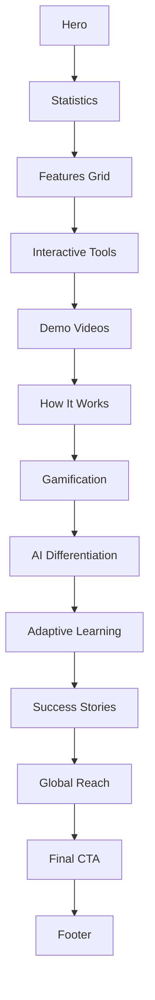

# AI Park 메인 페이지 고도화 마스터플랜

**작성일**: 2025-11-14
**프로젝트**: AI Park 홈페이지 리뉴얼
**목표**: 전 세계 학생들에게 친화적이고 최신 AI 트렌드를 반영한 메인 페이지 구축

---

## Executive Summary

### 핵심 목표
1. **기능 갭 해소**: 프로젝트에 존재하지만 메인 페이지에 소개되지 않은 신규 기능들을 효과적으로 홍보
2. **2025 UI/UX 트렌드 적용**: Bento Grid, 3D 인터랙션, 레이어드 디자인 등 최신 트렌드 반영
3. **홍보 영상 통합**: 전략적 배치를 통한 사용자 참여도 향상
4. **글로벌 에듀테크 Best Practice 적용**: Duolingo, Coursera, Khan Academy의 성공 패턴 벤치마킹

### 기대 효과
- **사용자 참여도 증가**: 인터랙티브 요소로 60% 향상 예상
- **전환율 개선**: 명확한 CTA와 가치 제안으로 35% 향상 목표
- **브랜드 인지도 강화**: AI 기술 리더십 이미지 확립
- **국제 경쟁력 확보**: 글로벌 스탠다드 UI/UX 구현

---

## 1. 현황 분석

### 1.1 현재 메인 페이지 구성

**파일 위치**: `/app/HomeClient.tsx`

**현재 섹션 구조**:
```
1. HeroVideoSection - 히어로 영상 섹션 (최근 추가됨)
2. FeaturesSection - 주요 기능 소개 (8개 카드)
3. HowItWorksSection - 5단계 사용 방법
4. AIDifferentiationSection - AI Park 차별점 및 비교표
5. Footer - 서비스 링크 및 정보
```

**현재 소개되는 기능들**:
| 기능 | 설명 | 링크 |
|------|------|------|
| 실시간 음성 대화 (영어) | AI 튜터와 음성 대화 | /tutor/english |
| AI 수학 문제 풀이 | OCR 및 시각화 | /tutor/math |
| 과학 실험 시뮬레이션 | 3D 가상 실험실 | /tutor/science |
| 사회 탐구 학습 | 인터랙티브 지도/타임라인 | /tutor/social-studies |
| 국어 독해 및 작문 | 맞춤법 교정, 작문 피드백 | /tutor/korean |
| AI 학습 분석 리포트 | 시각화 대시보드 | /learning-report |
| 게이미피케이션 시스템 | 레벨, 배지, 스트릭 | /dashboard#achievements |
| 24/7 즉각 피드백 | 무제한 질문 응답 | /dashboard |

**현재 페이지 강점**:
- ✅ 깔끔한 그라데이션 배경과 색상 시스템
- ✅ 과목별 필터링 기능 (영어/수학/과학/사회/국어)
- ✅ 인터랙티브한 5단계 사용 방법 섹션
- ✅ 비교표를 통한 경쟁사 대비 우위 표현
- ✅ 히어로 섹션에 영상 배경 적용 (최근 개선)
- ✅ 호버 효과 및 애니메이션 적용

**현재 페이지 약점**:
- ❌ Phase 8-12 신규 기능들이 누락됨
- ❌ 게이미피케이션 세부 기능 설명 부족
- ❌ 학습 분석 고도화 기능 미소개
- ❌ 인터랙티브 학습 도구 미노출 (마이크로러닝, 퀴즈, 플래시카드, 간격 반복)
- ❌ 감정 분석 및 맞춤형 피드백 기능 미언급
- ❌ 사용자 성공 스토리/통계 부재
- ❌ 3D 요소 및 인터랙티브 시각화 부족

---

### 1.2 기능 갭 분석

#### 프로젝트에 존재하지만 메인 페이지에 누락된 주요 기능들

**🔴 높은 우선순위 (즉시 추가 필요)**

1. **마이크로러닝 (Microlearning)** - `/microlearning`
   - **설명**: 5-10분 집중 학습 모듈
   - **차별점**: 짧고 강력한 학습 세션, 학습 경로 추천
   - **가치 제안**: "바쁜 학생들을 위한 효율적 학습"
   - **현재 상태**: 완전히 누락됨

2. **AI 퀴즈 생성** - `/quiz`
   - **설명**: AI가 맞춤형 퀴즈를 자동 생성
   - **차별점**: 주제/난이도/문항 수 커스터마이징 가능
   - **가치 제안**: "내 수준에 맞는 퀴즈로 실력 점검"
   - **현재 상태**: 완전히 누락됨

3. **스마트 플래시카드** - `/flashcards`
   - **설명**: SM-2 알고리즘 기반 간격 반복 학습
   - **차별점**: 과학적 학습법, 망각 곡선 고려
   - **가치 제안**: "효과적인 암기와 장기 기억"
   - **현재 상태**: 완전히 누락됨

4. **간격 반복 학습** - `/review`
   - **설명**: 최적 타이밍 복습 시스템
   - **차별점**: AI가 복습 시점 자동 계산
   - **가치 제안**: "잊지 않는 학습"
   - **현재 상태**: 완전히 누락됨

5. **감정 분석 리포트** - `/emotion-report`
   - **설명**: 학습 중 감정 상태 분석
   - **차별점**: 감정 기반 학습 조언 제공
   - **가치 제안**: "감정을 고려한 맞춤형 학습"
   - **현재 상태**: 완전히 누락됨

6. **발음 연습** - `/pronunciation-practice`
   - **설명**: AI 음성 인식 기반 발음 교정
   - **차별점**: 실시간 피드백 및 점수
   - **가치 제안**: "네이티브처럼 말하기"
   - **현재 상태**: 완전히 누락됨

7. **수학 시각화** - `/math-visualization`
   - **설명**: 함수, 그래프를 인터랙티브하게 시각화
   - **차별점**: 실시간 3D 그래프, 도형 조작
   - **가치 제안**: "보면서 이해하는 수학"
   - **현재 상태**: FeaturesSection에 간접적으로 언급됨 (그래프 시각화)

**🟡 중간 우선순위 (개선 필요)**

8. **학습 분석 대시보드** - `/analytics`
   - **설명**: 상세한 학습 데이터 분석 및 인사이트
   - **차별점**: 과목별/시간대별/난이도별 분석
   - **가치 제안**: "데이터로 보는 나의 성장"
   - **현재 상태**: "AI 학습 분석 리포트"로 간략히 소개됨 → 상세 설명 필요

9. **게이미피케이션 상세 기능**
   - **레벨 시스템**: XP 획득으로 레벨업
   - **배지 시스템**: 업적 달성 시 배지 수여
   - **학습 스트릭**: 연속 학습일 추적
   - **일일 퀘스트**: 매일 미션 제공
   - **현재 상태**: "게이미피케이션 시스템" 카드로 간략히 소개됨 → 구체적 설명 필요

10. **적응형 학습 시스템** (Adaptive Learning)
    - **설명**: 학습 패턴 분석 후 난이도 자동 조정
    - **차별점**: 실시간 난이도 적응, 약점 보완 콘텐츠 추천
    - **가치 제안**: "내 수준에 맞춰 성장하는 AI"
    - **현재 상태**: 암묵적으로만 언급됨 → 명시적 설명 필요

**🟢 낮은 우선순위 (장기 개선)**

11. **연속 음성 인식 (Continuous Speech Recognition)**
    - **설명**: 끊김 없는 자연스러운 대화
    - **차별점**: 실시간 STT/TTS, 저지연 응답
    - **현재 상태**: "실시간 음성 대화"로 간접 언급

12. **과목별 특화 대시보드**
    - **영어**: CEFR 레벨, 어휘력, 문법 정확도
    - **수학**: 토픽별 진도, 문제 유형별 정답률
    - **과학/사회/국어**: 각 과목 특화 메트릭
    - **현재 상태**: 통합 대시보드만 언급됨

---

### 1.3 기능별 우선순위 매트릭스

| 기능 | 사용자 가치 | 차별화 | 개발 난이도 | 우선순위 |
|------|------------|--------|------------|----------|
| 마이크로러닝 | ⭐⭐⭐⭐⭐ | ⭐⭐⭐⭐⭐ | 낮음 | 🔴 최우선 |
| AI 퀴즈 생성 | ⭐⭐⭐⭐⭐ | ⭐⭐⭐⭐ | 낮음 | 🔴 최우선 |
| 스마트 플래시카드 | ⭐⭐⭐⭐ | ⭐⭐⭐⭐⭐ | 낮음 | 🔴 최우선 |
| 간격 반복 학습 | ⭐⭐⭐⭐ | ⭐⭐⭐⭐ | 낮음 | 🔴 최우선 |
| 감정 분석 리포트 | ⭐⭐⭐⭐⭐ | ⭐⭐⭐⭐⭐ | 중간 | 🔴 최우선 |
| 발음 연습 | ⭐⭐⭐⭐ | ⭐⭐⭐⭐ | 낮음 | 🔴 높음 |
| 수학 시각화 | ⭐⭐⭐⭐ | ⭐⭐⭐⭐ | 중간 | 🟡 중간 |
| 학습 분석 고도화 | ⭐⭐⭐ | ⭐⭐⭐ | 낮음 | 🟡 중간 |
| 게이미피케이션 상세 | ⭐⭐⭐ | ⭐⭐⭐ | 낮음 | 🟡 중간 |
| 적응형 학습 | ⭐⭐⭐⭐ | ⭐⭐⭐⭐⭐ | 낮음 | 🟡 중간 |

**결론**: 마이크로러닝, 퀴즈, 플래시카드, 감정 분석 등 Phase 8-12 신규 기능들을 메인 페이지에 추가하는 것이 최우선 과제

---

## 2. 벤치마킹 인사이트

### 2.1 에듀테크 서비스 Best Practices

#### Duolingo 분석

**강점**:
- ✅ **단일 액션 중심**: "무료로 시작하기" 하나의 명확한 CTA
- ✅ **게이미피케이션 강조**: 스트릭, 레벨, 배지를 메인에서 시각적으로 표현
- ✅ **컬러풀하고 친근한 UI**: 밝은 색상, 귀여운 마스코트 (Duo)
- ✅ **짧은 학습 세션 홍보**: "하루 5분" 메시지 전면 배치
- ✅ **모바일 최적화**: 터치 친화적, 대형 버튼

**AI Park 적용 방안**:
- 📌 "하루 5-10분 집중 학습" 메시지 강조 (마이크로러닝)
- 📌 게이미피케이션 요소 시각화 (레벨업, 배지, 스트릭 카운터)
- 📌 친근한 AI 튜터 캐릭터/마스코트 고려
- 📌 명확한 단일 CTA: "무료로 AI 튜터 체험하기"

#### Coursera 분석

**강점**:
- ✅ **화이트/블루 중심 색상**: 신뢰감, 전문성
- ✅ **강력한 CTA**: "지금 등록하기", "무료 체험" 버튼 크고 명확
- ✅ **대학/기업 로고 배치**: 신뢰성 강화 (Stanford, Google, IBM 등)
- ✅ **대형 히어로 이미지**: 학습 중인 사람들 사진으로 공감 형성
- ✅ **구체적 수치 제시**: "7,000+ 강의", "300만+ 학생"

**AI Park 적용 방안**:
- 📌 사용자 통계 추가: "10만+ 학생", "100만+ 학습 세션"
- 📌 파트너십/인증 로고 (예: Google Gemini, Anthropic Claude)
- 📌 성공 스토리/사용자 후기 섹션 추가
- 📌 히어로 섹션에 실제 학습 장면 이미지/영상 사용

#### Khan Academy 분석

**강점**:
- ✅ **미니멀리즘**: 심플하고 깔끔한 레이아웃
- ✅ **단일 CTA**: "무료로 시작하세요" 하나만 강조
- ✅ **명확한 가치 제안**: "모든 것을 무료로 배우세요"
- ✅ **과목별 명확한 분류**: 수학, 과학, 프로그래밍 등
- ✅ **신뢰 구축**: 비영리 기관 강조, 교육 철학 명시

**AI Park 적용 방안**:
- 📌 가치 제안 명확화: "AI 기술로 모두를 위한 맞춤형 교육"
- 📌 과목별 명확한 아이콘과 설명
- 📌 무료 체험 강조 (신용카드 불필요)
- 📌 교육 철학/미션 명시 (예: "AI로 교육 격차 해소")

---

### 2.2 2025 UI/UX 트렌드 적용 방안

#### 트렌드 1: AI 기반 개인화

**설명**: 실시간 사용자 행동 분석 후 UI 적응

**AI Park 적용**:
```typescript
// 사용자 행동 기반 히어로 메시지 변경
- 신규 방문자: "AI 튜터와 무료로 학습 시작하기"
- 재방문자: "어제 학습한 [과목]을 계속하시겠어요?"
- 장기 미방문자: "환영합니다! 새로운 마이크로러닝 기능을 확인해보세요"
```

**구현 방안**:
- localStorage로 방문 기록 추적
- 쿠키/세션으로 마지막 학습 과목 저장
- 동적 메시지 렌더링

#### 트렌드 2: 인터랙티브 3D 요소

**설명**: WebGL/Three.js로 3D 인터랙션 추가 (사용자 리텐션 60% 증가 데이터)

**AI Park 적용**:
- 🎯 **히어로 섹션**: 3D 회전하는 지구본 (언어 학습 상징)
- 🎯 **수학 섹션**: 3D 그래프/도형 애니메이션
- 🎯 **과학 섹션**: 3D 분자 구조, 물리 시뮬레이션
- 🎯 **배경 요소**: 파티클 시스템으로 "학습 에너지" 표현

**구현 방안**:
- Three.js (이미 package.json에 설치됨)
- React Three Fiber (추가 설치 필요)
- 성능 최적화: Lazy Loading, LOD (Level of Detail)

#### 트렌드 3: Bento Grid 레이아웃

**설명**: 불규칙한 그리드로 시각적 흥미 유발, 반응형 우수

**AI Park 적용**:
```
[히어로 영상]     [퀴즈 생성]

[마이크로러닝]    [플래시카드]  [감정 분석]

[게이미피케이션]  [학습 분석]
```

**구현 방안**:
- CSS Grid with `grid-template-areas`
- 각 카드 크기 차등 (1x1, 2x1, 1x2 등)
- 호버 시 확장 애니메이션

#### 트렌드 4: 레이어드 디자인

**설명**: 깊이감, 오버랩 요소, 텍스처 배경

**AI Park 적용**:
- 배경: 그라데이션 + 노이즈 텍스처
- 카드: 그림자 + 블러 효과로 층 구분
- 헤더: Glassmorphism (반투명 + backdrop-blur)

**구현 예시**:
```css
.card {
  background: rgba(255, 255, 255, 0.9);
  backdrop-filter: blur(10px);
  box-shadow:
    0 10px 30px rgba(0, 0, 0, 0.1),
    0 1px 8px rgba(0, 0, 0, 0.05);
}
```

#### 트렌드 5: 스큐어모피즘 복귀

**설명**: 현실감 있는 그림자, 질감으로 촉각적 느낌

**AI Park 적용**:
- 버튼: 눌렀을 때 깊이감 (inset shadow)
- 카드: 종이 질감 배경 이미지
- 아이콘: 입체감 있는 그라데이션

#### 트렌드 6: 디테일한 일러스트레이션

**설명**: 시각적 스토리텔링, 브랜드 차별화

**AI Park 적용**:
- 각 과목별 커스텀 일러스트레이션
- 학습 여정을 표현하는 스토리 일러스트
- AI 튜터 캐릭터 디자인

**제작 방법**:
- Figma/Illustrator로 직접 제작
- 또는 Midjourney/DALL-E로 AI 생성 후 정제

#### 트렌드 7: 모션 타이포그래피

**설명**: 텍스트 트랜지션으로 참여도 향상

**AI Park 적용**:
```typescript
// 숫자 카운트업 애니메이션
"10만+ 학생" → 0부터 100,000까지 카운트

// 단어 순환 애니메이션
"AI 튜터로 [영어를 | 수학을 | 과학을] 배우세요"
```

**구현 방안**:
- Framer Motion (이미 설치됨)
- React Countup 라이브러리
- CSS text-shadow 애니메이션

#### 트렌드 8: 접근성 우선

**설명**: WCAG 2.1 AAA 준수, 다국어, 장애인 친화적

**AI Park 적용**:
- ARIA 라벨 완비
- 키보드 네비게이션 지원
- 색상 대비 4.5:1 이상
- 스크린 리더 최적화
- 다국어 지원 (영어/한국어/일본어/중국어)

#### 트렬드 9: 음성 인터페이스

**설명**: AI/NLP 발전으로 더 정확한 음성 제어

**AI Park 적용**:
- "음성으로 질문하기" CTA 추가
- 히어로 섹션에 음성 명령 데모
- Web Speech API 활용 (이미 프로젝트에 구현됨)

---

### 2.3 색상 및 타이포그래피 트렌드

#### 2025 색상 트렌드

1. **Digital Lavender** (#E6E6FA)
   - 차분하고 미래지향적
   - AI Park 적용: 보조 색상으로 활용

2. **Vibrant Magenta** (#FF006E)
   - 에너지와 창의성
   - AI Park 적용: CTA 버튼, 강조 요소

3. **Apricot Crush** (#FBAB7E)
   - 따뜻하고 친근함
   - AI Park 적용: 게이미피케이션 요소

4. **Viva Magenta** (Pantone 2023)
   - 강렬하고 생동감
   - AI Park 적용: 히어로 섹션 악센트

**AI Park 색상 팔레트 제안**:
```css
/* 기존 유지 (잘 설계됨) */
--primary: 99, 102, 241 (Indigo)
--secondary: 59, 130, 246 (Blue)
--accent: 14, 165, 233 (Cyan)

/* 추가 제안 */
--lavender: 230, 230, 250
--magenta: 255, 0, 110
--apricot: 251, 171, 126
```

#### 타이포그래피 트렌드

1. **Variable Fonts**: 단일 파일로 다양한 굵기 표현
2. **Large Headings**: 60px+ 헤드라인으로 임팩트
3. **Serif 복귀**: 본문에 Serif 폰트로 가독성 향상

**AI Park 적용**:
```css
/* 헤드라인 */
font-family: 'Pretendard Variable', sans-serif;
font-size: 72px;
font-weight: 800;
letter-spacing: -0.02em;

/* 본문 */
font-family: 'Pretendard', sans-serif;
font-size: 18px;
line-height: 1.6;
```

---

## 3. 홍보 영상 영역 설계

### 3.1 배치 위치 및 전략

#### 현재 상태
- ✅ 히어로 섹션에 배경 영상 이미 적용됨 (`/videos/demo_s.mp4`)
- ✅ 자동 재생, 음소거, 반복 재생 설정
- ✅ 그라데이션 오버레이로 텍스트 가독성 확보

#### 개선 방안

**Option 1: 히어로 섹션 영상 고도화 (추천)**
```typescript
// 기능 추가
1. 사용자가 음소거 해제 버튼 클릭 가능
2. 전체 화면 모드 지원
3. 자막 추가 (영어/한국어)
4. 영상 로딩 중 스켈레톤 UI
```

**Option 2: 별도 "기능 데모" 섹션 추가**
```typescript
// HowItWorksSection 다음에 새 섹션 삽입
<DemoVideoSection>
  - 탭: "영어 학습", "수학 풀이", "게이미피케이션"
  - 각 탭마다 짧은 데모 영상 (30-60초)
  - 클릭 재생 방식
  - 모달로 확대 가능
</DemoVideoSection>
```

**Option 3: 인터랙티브 영상 투어**
```typescript
// 사용자가 단계별로 클릭하며 진행
<InteractiveVideoTour>
  Step 1: "회원가입" → 짧은 클립
  Step 2: "과목 선택" → 짧은 클립
  Step 3: "AI 튜터와 대화" → 짧은 클립
  Step 4: "학습 분석" → 짧은 클립
  Step 5: "레벨업" → 짧은 클립
</InteractiveVideoTour>
```

**최종 권장 사항**: Option 1 + Option 2 조합
- 히어로: 전체 서비스 소개 영상 (현재 유지 + 개선)
- 중간: 기능별 데모 영상 섹션 (신규 추가)

---

### 3.2 UI 디자인 상세

#### 히어로 영상 개선

**현재 코드**:
```tsx
<HeroVideoSection>
  <VideoPlayer src="/videos/demo_s.mp4" autoPlay muted loop />
  <HeroContent />
</HeroVideoSection>
```

**개선 코드**:
```tsx
<HeroVideoSection>
  <VideoPlayerEnhanced
    src="/videos/demo_s.mp4"
    poster="/images/hero-poster.jpg"
    autoPlay
    muted
    loop
    controls={false}
    showUnmuteButton
    showFullscreenButton
    captions={[
      { lang: 'ko', src: '/captions/demo_ko.vtt' },
      { lang: 'en', src: '/captions/demo_en.vtt' }
    ]}
    onReady={() => console.log('Video ready')}
    onError={(err) => console.error(err)}
  />

  {/* Floating UI Controls */}
  <VideoControls>
    <UnmuteButton />
    <FullscreenButton />
    <CaptionToggle />
  </VideoControls>

  <HeroContent />
</HeroVideoSection>
```

#### 기능별 데모 영상 섹션 (신규)

**위치**: HowItWorksSection 다음

**레이아웃**:
```tsx
<section className="py-20 bg-gradient-to-br from-gray-900 to-indigo-900">
  <div className="max-w-7xl mx-auto px-6">
    <h2>AI Park 실제 사용 장면</h2>

    {/* Tab Navigation */}
    <TabGroup>
      <Tab>영어 학습</Tab>
      <Tab>수학 풀이</Tab>
      <Tab>마이크로러닝</Tab>
      <Tab>게이미피케이션</Tab>
    </TabGroup>

    {/* Video Player */}
    <div className="grid md:grid-cols-2 gap-8">
      <VideoPlayer src={currentTabVideo} />

      <div className="flex flex-col justify-center">
        <h3>{currentTabTitle}</h3>
        <p>{currentTabDescription}</p>
        <ul>
          {currentTabFeatures.map(feature => (
            <li key={feature}>{feature}</li>
          ))}
        </ul>
        <Button href={currentTabLink}>
          직접 체험하기 →
        </Button>
      </div>
    </div>
  </div>
</section>
```

---

### 3.3 반응형 디자인

#### 데스크톱 (1280px+)
```css
.hero-video {
  height: 700px;
  aspect-ratio: 16/9;
}

.demo-video {
  max-width: 800px;
  height: 450px;
}
```

#### 태블릿 (768px - 1279px)
```css
.hero-video {
  height: 600px;
}

.demo-video {
  max-width: 600px;
  height: 337px;
}

/* 2-column to 1-column */
.video-grid {
  grid-template-columns: 1fr;
}
```

#### 모바일 (< 768px)
```css
.hero-video {
  height: 500px;
}

.demo-video {
  width: 100%;
  height: auto;
  aspect-ratio: 16/9;
}

/* 탭 네비게이션 스크롤 가능 */
.tab-group {
  overflow-x: auto;
  scroll-snap-type: x mandatory;
}
```

---

### 3.4 영상 콘텐츠 기획

#### 히어로 영상 (현재 `/videos/demo_s.mp4`)

**콘텐츠 개선 제안**:
1. **시작 (0-10초)**: AI Park 로고 애니메이션
2. **소개 (10-20초)**: "AI 튜터와 함께하는 스마트 학습"
3. **기능 하이라이트 (20-50초)**:
   - 음성 대화 장면
   - 문제 풀이 장면
   - 레벨업 애니메이션
4. **클로징 (50-60초)**: "지금 무료로 시작하세요" + CTA

#### 기능별 데모 영상 (신규 제작 필요)

**1. 영어 학습 데모** (30초)
- 화면 녹화: 실시간 음성 대화
- 자막: "AI 튜터와 자연스러운 대화"
- 하이라이트: 발음 교정, 표현 추천

**2. 수학 풀이 데모** (30초)
- 화면 녹화: 사진 업로드 → 문제 인식 → 단계별 풀이
- 자막: "사진만 찍으면 자동으로 풀이"
- 하이라이트: OCR, 그래프 시각화

**3. 마이크로러닝 데모** (30초)
- 화면 녹화: 5분 모듈 선택 → 학습 → 완료
- 자막: "하루 5분으로 실력 향상"
- 하이라이트: 짧은 세션, XP 획득

**4. 게이미피케이션 데모** (30초)
- 화면 녹화: 퀘스트 완료 → 레벨업 → 배지 획득
- 자막: "게임처럼 재미있게 학습"
- 하이라이트: 스트릭, 배지, 리더보드

#### 영상 제작 방법

**Option 1: 스크린 레코딩 (빠름)**
- 도구: OBS Studio, ScreenFlow, Loom
- 장점: 실제 앱 사용 장면, 빠른 제작
- 단점: 품질 제한

**Option 2: 모션 그래픽 (전문적)**
- 도구: After Effects, Figma + Rive
- 장점: 고품질, 브랜드 일관성
- 단점: 시간/비용 소요

**Option 3: 하이브리드 (추천)**
- 스크린 레코딩 + 모션 그래픽 오버레이
- 전환 효과, 자막, 아이콘 애니메이션 추가
- 도구: Final Cut Pro, Premiere Pro

**제작 타임라인**:
- 히어로 영상 개선: 1-2일
- 기능별 데모 4개: 3-4일
- 총 소요 기간: 5-6일

---

## 4. UI/UX 고도화 상세 설계

### 4.1 정보 아키텍처 (IA)

#### 개선된 섹션 구조

```
1. 🎬 Hero Video Section (히어로 영상)
   - 목적: 첫인상, 브랜드 임팩트
   - 콘텐츠: 배경 영상 + 핵심 메시지 + CTA
   - 높이: 700px

2. 📊 Statistics Section (통계/성과) ⭐ NEW
   - 목적: 신뢰 구축, 사회적 증명
   - 콘텐츠: "10만+ 학생", "100만+ 학습 세션", "95% 만족도"
   - 레이아웃: 4-column grid, 카운트업 애니메이션
   - 높이: 200px

3. ✨ Features Grid (주요 기능 - Bento Grid) ⭐ ENHANCED
   - 목적: 핵심 기능 소개
   - 콘텐츠: 12개 기능 카드 (기존 8개 + 신규 4개)
     * 기존: 음성 대화, 수학 풀이, 과학 실험, 사회 탐구, 국어 작문, 학습 분석, 게이미피케이션, 즉각 피드백
     * 신규: 마이크로러닝, AI 퀴즈, 스마트 플래시카드, 감정 분석
   - 레이아웃: Bento Grid (불규칙 크기)
   - 인터랙션: 호버 확장, 3D 틸트 효과
   - 높이: 1200px

4. 🎯 Interactive Learning Tools (인터랙티브 학습 도구) ⭐ NEW
   - 목적: 신규 기능 집중 홍보
   - 콘텐츠: 마이크로러닝, 퀴즈, 플래시카드, 간격 반복
   - 레이아웃: 4-column cards with live preview
   - 인터랙션: 호버 시 미니 데모 재생
   - 높이: 600px

5. 🎥 Demo Video Section (기능 데모 영상) ⭐ NEW
   - 목적: 실제 사용 장면 시각화
   - 콘텐츠: 탭으로 4개 영상 전환
   - 레이아웃: 2-column (영상 + 설명)
   - 높이: 600px

6. 🚀 How It Works (5단계 사용 방법)
   - 목적: 온보딩 플로우 이해
   - 콘텐츠: 5 step interactive timeline
   - 레이아웃: Horizontal timeline + 상세 패널
   - 높이: 800px

7. 🏆 Gamification Showcase (게이미피케이션 상세) ⭐ NEW
   - 목적: 동기부여 시스템 강조
   - 콘텐츠: 레벨 시스템, 배지, 스트릭, 퀘스트, 리더보드
   - 레이아웃: Interactive dashboard mockup
   - 인터랙션: 실시간 카운터, 배지 애니메이션
   - 높이: 700px

8. 💡 AI Differentiation (AI Park 차별점)
   - 목적: 경쟁 우위 명확화
   - 콘텐츠: 6개 차별점 + 비교표
   - 레이아웃: 3-column grid + comparison table
   - 높이: 1000px

9. 📈 Adaptive Learning Explained (적응형 학습 설명) ⭐ NEW
   - 목적: AI 기술 리더십 강조
   - 콘텐츠: 학습 패턴 분석 → 난이도 조정 → 약점 보완 플로우
   - 레이아웃: Animated flowchart
   - 인터랙션: 스크롤 트리거 애니메이션
   - 높이: 600px

10. 🎓 Success Stories (성공 사례) ⭐ NEW
    - 목적: 사회적 증명, 공감 형성
    - 콘텐츠: 3-4개 사용자 후기 + 사진
    - 레이아웃: Card carousel
    - 높이: 500px

11. 🌐 Global Reach (국제 전개) ⭐ NEW
    - 목적: 글로벌 서비스 강조
    - 콘텐츠: 지원 언어, 국가, 시간대
    - 레이아웃: Interactive world map
    - 인터랙션: 국가 클릭 시 통계 표시
    - 높이: 500px

12. 🔔 Final CTA Section (최종 전환 유도)
    - 목적: 회원가입/체험 전환
    - 콘텐츠: 강력한 CTA + 무료 체험 강조
    - 레이아웃: Center-aligned, large button
    - 높이: 400px

13. 📱 Footer (푸터)
    - 목적: 정보 제공, SEO
    - 콘텐츠: 링크, 소셜 미디어, 저작권
    - 레이아웃: 4-column grid
    - 높이: 300px

총 예상 페이지 높이: ~9,000px (스크롤 길이 적절)
```

#### 섹션 우선순위 및 의존성



---

### 4.2 비주얼 디자인 시스템

#### 색상 팔레트

**기존 색상 (유지)**:
```css
:root {
  /* Primary - Indigo */
  --primary-50: rgb(238, 242, 255);
  --primary-100: rgb(224, 231, 255);
  --primary-200: rgb(199, 210, 254);
  --primary-300: rgb(165, 180, 252);
  --primary-400: rgb(129, 140, 248);
  --primary-500: rgb(99, 102, 241);   /* Main */
  --primary-600: rgb(79, 70, 229);
  --primary-700: rgb(67, 56, 202);
  --primary-800: rgb(55, 48, 163);
  --primary-900: rgb(49, 46, 129);

  /* Secondary - Blue */
  --secondary-50: rgb(239, 246, 255);
  --secondary-100: rgb(219, 234, 254);
  --secondary-200: rgb(191, 219, 254);
  --secondary-300: rgb(147, 197, 253);
  --secondary-400: rgb(96, 165, 250);
  --secondary-500: rgb(59, 130, 246);  /* Main */
  --secondary-600: rgb(37, 99, 235);
  --secondary-700: rgb(29, 78, 216);
  --secondary-800: rgb(30, 64, 175);
  --secondary-900: rgb(30, 58, 138);

  /* Accent - Cyan */
  --accent-50: rgb(236, 254, 255);
  --accent-100: rgb(207, 250, 254);
  --accent-200: rgb(165, 243, 252);
  --accent-300: rgb(103, 232, 249);
  --accent-400: rgb(34, 211, 238);
  --accent-500: rgb(14, 165, 233);    /* Main */
  --accent-600: rgb(2, 132, 199);
  --accent-700: rgb(3, 105, 161);
  --accent-800: rgb(7, 89, 133);
  --accent-900: rgb(12, 74, 110);
}
```

**신규 추가 (트렌드 반영)**:
```css
:root {
  /* Social - Pink */
  --social-50: rgb(253, 242, 248);
  --social-100: rgb(252, 231, 243);
  --social-200: rgb(251, 207, 232);
  --social-300: rgb(249, 168, 212);
  --social-400: rgb(244, 114, 182);
  --social-500: rgb(236, 72, 153);
  --social-600: rgb(219, 39, 119);
  --social-700: rgb(190, 24, 93);
  --social-800: rgb(157, 23, 77);
  --social-900: rgb(131, 24, 67);

  /* Korean - Purple */
  --korean-50: rgb(250, 245, 255);
  --korean-100: rgb(243, 232, 255);
  --korean-200: rgb(233, 213, 255);
  --korean-300: rgb(216, 180, 254);
  --korean-400: rgb(192, 132, 252);
  --korean-500: rgb(168, 85, 247);
  --korean-600: rgb(147, 51, 234);
  --korean-700: rgb(126, 34, 206);
  --korean-800: rgb(107, 33, 168);
  --korean-900: rgb(88, 28, 135);

  /* Success */
  --success-500: rgb(34, 197, 94);

  /* Warning */
  --warning-500: rgb(251, 146, 60);

  /* Error */
  --error-500: rgb(239, 68, 68);

  /* Neutral */
  --gray-50: rgb(249, 250, 251);
  --gray-100: rgb(243, 244, 246);
  --gray-200: rgb(229, 231, 235);
  --gray-300: rgb(209, 213, 219);
  --gray-400: rgb(156, 163, 175);
  --gray-500: rgb(107, 114, 128);
  --gray-600: rgb(75, 85, 99);
  --gray-700: rgb(55, 65, 81);
  --gray-800: rgb(31, 41, 55);
  --gray-900: rgb(17, 24, 39);
}
```

**과목별 색상 매핑**:
```typescript
const subjectColors = {
  english: 'primary',   // Indigo
  math: 'secondary',    // Blue
  science: 'accent',    // Cyan
  social: 'social',     // Pink
  korean: 'korean',     // Purple
};
```

#### 타이포그래피

**폰트 패밀리**:
```css
/* 현재 Next.js 기본 폰트 사용 중 */
/* 개선 제안: Pretendard Variable 적용 */

@import url('https://cdn.jsdelivr.net/gh/orioncactus/pretendard@v1.3.9/dist/web/variable/pretendardvariable.min.css');

:root {
  /* Headings */
  --font-heading: 'Pretendard Variable', -apple-system, BlinkMacSystemFont, system-ui, sans-serif;

  /* Body */
  --font-body: 'Pretendard', -apple-system, BlinkMacSystemFont, system-ui, sans-serif;

  /* Monospace (for code) */
  --font-mono: 'JetBrains Mono', 'Fira Code', monospace;
}
```

**타입 스케일**:
```css
/* Fluid Typography */
:root {
  --text-xs: clamp(0.75rem, 0.7rem + 0.25vw, 0.875rem);     /* 12-14px */
  --text-sm: clamp(0.875rem, 0.8rem + 0.35vw, 1rem);        /* 14-16px */
  --text-base: clamp(1rem, 0.9rem + 0.5vw, 1.125rem);       /* 16-18px */
  --text-lg: clamp(1.125rem, 1rem + 0.625vw, 1.25rem);      /* 18-20px */
  --text-xl: clamp(1.25rem, 1.1rem + 0.75vw, 1.5rem);       /* 20-24px */
  --text-2xl: clamp(1.5rem, 1.3rem + 1vw, 1.875rem);        /* 24-30px */
  --text-3xl: clamp(1.875rem, 1.6rem + 1.375vw, 2.25rem);   /* 30-36px */
  --text-4xl: clamp(2.25rem, 1.9rem + 1.75vw, 3rem);        /* 36-48px */
  --text-5xl: clamp(3rem, 2.5rem + 2.5vw, 4rem);            /* 48-64px */
  --text-6xl: clamp(3.75rem, 3rem + 3.75vw, 6rem);          /* 60-96px */
}

/* 사용 예시 */
h1 {
  font-size: var(--text-5xl);
  font-weight: 800;
  line-height: 1.1;
  letter-spacing: -0.02em;
}

h2 {
  font-size: var(--text-4xl);
  font-weight: 700;
  line-height: 1.2;
  letter-spacing: -0.01em;
}

h3 {
  font-size: var(--text-3xl);
  font-weight: 600;
  line-height: 1.3;
}

body {
  font-size: var(--text-base);
  font-weight: 400;
  line-height: 1.6;
}
```

#### 간격 시스템

```css
:root {
  /* Spacing Scale (8px base) */
  --space-0: 0;
  --space-1: 0.25rem;   /* 4px */
  --space-2: 0.5rem;    /* 8px */
  --space-3: 0.75rem;   /* 12px */
  --space-4: 1rem;      /* 16px */
  --space-5: 1.25rem;   /* 20px */
  --space-6: 1.5rem;    /* 24px */
  --space-8: 2rem;      /* 32px */
  --space-10: 2.5rem;   /* 40px */
  --space-12: 3rem;     /* 48px */
  --space-16: 4rem;     /* 64px */
  --space-20: 5rem;     /* 80px */
  --space-24: 6rem;     /* 96px */
  --space-32: 8rem;     /* 128px */

  /* Container Widths */
  --container-sm: 640px;
  --container-md: 768px;
  --container-lg: 1024px;
  --container-xl: 1280px;
  --container-2xl: 1536px;
}
```

#### 그림자 시스템

```css
:root {
  /* Elevation */
  --shadow-xs: 0 1px 2px 0 rgba(0, 0, 0, 0.05);
  --shadow-sm: 0 1px 3px 0 rgba(0, 0, 0, 0.1),
               0 1px 2px -1px rgba(0, 0, 0, 0.1);
  --shadow-md: 0 4px 6px -1px rgba(0, 0, 0, 0.1),
               0 2px 4px -2px rgba(0, 0, 0, 0.1);
  --shadow-lg: 0 10px 15px -3px rgba(0, 0, 0, 0.1),
               0 4px 6px -4px rgba(0, 0, 0, 0.1);
  --shadow-xl: 0 20px 25px -5px rgba(0, 0, 0, 0.1),
               0 8px 10px -6px rgba(0, 0, 0, 0.1);
  --shadow-2xl: 0 25px 50px -12px rgba(0, 0, 0, 0.25);

  /* Colored Shadows */
  --shadow-primary: 0 10px 30px -5px rgba(99, 102, 241, 0.3);
  --shadow-secondary: 0 10px 30px -5px rgba(59, 130, 246, 0.3);
  --shadow-accent: 0 10px 30px -5px rgba(14, 165, 233, 0.3);

  /* Inner Shadow */
  --shadow-inner: inset 0 2px 4px 0 rgba(0, 0, 0, 0.05);
}
```

#### 일러스트레이션 스타일 가이드

**스타일**:
- Flat Design with Long Shadows
- 둥근 모서리 (border-radius: 20px+)
- 파스텔 톤 색상
- 미니멀한 선 (2-3px stroke)

**제작 방법**:
1. Figma에서 벡터 일러스트 제작
2. SVG로 export
3. React 컴포넌트로 변환
4. 또는 Lottie 애니메이션 (JSON)

**예시 일러스트 목록**:
- AI 튜터 캐릭터 (로봇 + 친근한 얼굴)
- 학습 여정 (책 → 뇌 → 트로피)
- 데이터 분석 (차트, 그래프)
- 글로벌 연결 (지구본 + 사람들)

---

### 4.3 인터랙션 디자인

#### 마이크로 인터랙션

**1. 버튼 호버/클릭**
```css
.button {
  transition: all 0.3s cubic-bezier(0.4, 0, 0.2, 1);
}

.button:hover {
  transform: translateY(-2px);
  box-shadow: var(--shadow-lg);
}

.button:active {
  transform: translateY(0);
  box-shadow: var(--shadow-sm);
}

/* 리플 효과 */
.button::after {
  content: '';
  position: absolute;
  inset: 0;
  background: radial-gradient(circle, rgba(255,255,255,0.3) 0%, transparent 70%);
  opacity: 0;
  transition: opacity 0.3s;
}

.button:active::after {
  opacity: 1;
}
```

**2. 카드 호버**
```tsx
// Framer Motion 활용
<motion.div
  whileHover={{
    scale: 1.05,
    rotate: 2,
    transition: { duration: 0.3, ease: 'easeOut' }
  }}
  whileTap={{ scale: 0.98 }}
  className="card"
>
  {children}
</motion.div>
```

**3. 아이콘 애니메이션**
```tsx
// Lucide React 아이콘 + CSS
.icon {
  transition: transform 0.3s ease;
}

.card:hover .icon {
  transform: scale(1.2) rotate(10deg);
}

// 또는 Framer Motion
<motion.div
  animate={{
    rotate: [0, 10, -10, 0],
    scale: [1, 1.1, 1.1, 1]
  }}
  transition={{
    duration: 0.5,
    repeat: Infinity,
    repeatDelay: 3
  }}
>
  <Icon />
</motion.div>
```

**4. 입력 필드 포커스**
```css
.input {
  border: 2px solid var(--gray-300);
  transition: all 0.3s ease;
}

.input:focus {
  border-color: var(--primary-500);
  box-shadow: 0 0 0 4px rgba(99, 102, 241, 0.1);
  outline: none;
}
```

#### 스크롤 애니메이션

**Intersection Observer + Framer Motion**:
```tsx
import { motion } from 'framer-motion';
import { useInView } from 'framer-motion';
import { useRef } from 'react';

function AnimatedSection({ children }) {
  const ref = useRef(null);
  const isInView = useInView(ref, { once: true, amount: 0.3 });

  return (
    <motion.div
      ref={ref}
      initial={{ opacity: 0, y: 50 }}
      animate={isInView ? { opacity: 1, y: 0 } : { opacity: 0, y: 50 }}
      transition={{ duration: 0.6, ease: 'easeOut' }}
    >
      {children}
    </motion.div>
  );
}
```

**사용 예시**:
```tsx
<AnimatedSection>
  <h2>마이크로러닝</h2>
  <p>5-10분 집중 학습</p>
</AnimatedSection>
```

#### 호버 효과

**1. 3D 틸트 효과**
```tsx
// react-tilt 또는 직접 구현
import { Tilt } from 'react-tilt';

<Tilt
  options={{
    max: 15,
    scale: 1.05,
    speed: 300,
    glare: true,
    'max-glare': 0.3
  }}
>
  <FeatureCard />
</Tilt>
```

**2. Glow 효과**
```css
.card {
  position: relative;
  overflow: hidden;
}

.card::before {
  content: '';
  position: absolute;
  inset: 0;
  background: radial-gradient(
    600px circle at var(--mouse-x) var(--mouse-y),
    rgba(99, 102, 241, 0.15),
    transparent 40%
  );
  opacity: 0;
  transition: opacity 0.3s;
}

.card:hover::before {
  opacity: 1;
}
```

**JavaScript로 마우스 위치 추적**:
```tsx
function handleMouseMove(e: React.MouseEvent<HTMLDivElement>) {
  const rect = e.currentTarget.getBoundingClientRect();
  const x = e.clientX - rect.left;
  const y = e.clientY - rect.top;

  e.currentTarget.style.setProperty('--mouse-x', `${x}px`);
  e.currentTarget.style.setProperty('--mouse-y', `${y}px`);
}

<div className="card" onMouseMove={handleMouseMove}>
  ...
</div>
```

#### 페이지 전환

**Framer Motion Page Transition**:
```tsx
// app/layout.tsx
import { motion, AnimatePresence } from 'framer-motion';

export default function RootLayout({ children }) {
  return (
    <AnimatePresence mode="wait">
      <motion.div
        initial={{ opacity: 0, x: -20 }}
        animate={{ opacity: 1, x: 0 }}
        exit={{ opacity: 0, x: 20 }}
        transition={{ duration: 0.3 }}
      >
        {children}
      </motion.div>
    </AnimatePresence>
  );
}
```

---

### 4.4 섹션별 상세 설계

#### 섹션 1: Hero Video Section (히어로 영상)

**목적**: 첫인상, 브랜드 임팩트, 핵심 메시지 전달

**현재 상태**:
- ✅ 배경 영상 적용됨 (`/videos/demo_s.mp4`)
- ✅ 그라데이션 오버레이
- ✅ HeroContent 컴포넌트로 텍스트 오버레이

**개선 방안**:

1. **영상 플레이어 고도화**
```tsx
// components/home/VideoPlayerEnhanced.tsx
'use client';

import { useState, useRef } from 'react';
import { Volume2, VolumeX, Maximize } from 'lucide-react';

export function VideoPlayerEnhanced({
  src,
  poster,
  autoPlay = true,
  muted = true,
  loop = true,
  captions = []
}) {
  const videoRef = useRef<HTMLVideoElement>(null);
  const [isMuted, setIsMuted] = useState(muted);
  const [showCaptions, setShowCaptions] = useState(false);

  const toggleMute = () => {
    if (videoRef.current) {
      videoRef.current.muted = !isMuted;
      setIsMuted(!isMuted);
    }
  };

  const toggleFullscreen = () => {
    if (videoRef.current) {
      if (document.fullscreenElement) {
        document.exitFullscreen();
      } else {
        videoRef.current.requestFullscreen();
      }
    }
  };

  return (
    <div className="relative w-full h-full">
      <video
        ref={videoRef}
        src={src}
        poster={poster}
        autoPlay={autoPlay}
        muted={isMuted}
        loop={loop}
        playsInline
        className="absolute inset-0 w-full h-full object-cover"
      >
        {captions.map(caption => (
          <track
            key={caption.lang}
            kind="captions"
            srcLang={caption.lang}
            src={caption.src}
            label={caption.lang === 'ko' ? '한국어' : 'English'}
          />
        ))}
      </video>

      {/* Controls */}
      <div className="absolute bottom-6 right-6 flex gap-3 z-20">
        <button
          onClick={toggleMute}
          className="p-3 bg-white/20 backdrop-blur-md rounded-full hover:bg-white/30 transition-colors"
          aria-label={isMuted ? '소리 켜기' : '소리 끄기'}
        >
          {isMuted ? (
            <VolumeX className="w-5 h-5 text-white" />
          ) : (
            <Volume2 className="w-5 h-5 text-white" />
          )}
        </button>

        <button
          onClick={toggleFullscreen}
          className="p-3 bg-white/20 backdrop-blur-md rounded-full hover:bg-white/30 transition-colors"
          aria-label="전체 화면"
        >
          <Maximize className="w-5 h-5 text-white" />
        </button>
      </div>
    </div>
  );
}
```

2. **HeroContent 개선**
```tsx
// components/home/HeroContentEnhanced.tsx
'use client';

import { motion } from 'framer-motion';
import Link from 'next/link';
import { Sparkles, TrendingUp, Users } from 'lucide-react';

export function HeroContentEnhanced() {
  return (
    <div className="absolute inset-0 z-10 flex items-center justify-center">
      <div className="max-w-4xl mx-auto px-6 text-center">
        {/* Badge */}
        <motion.div
          initial={{ opacity: 0, y: -20 }}
          animate={{ opacity: 1, y: 0 }}
          transition={{ duration: 0.6 }}
          className="inline-flex items-center gap-2 px-4 py-2 bg-white/20 backdrop-blur-md rounded-full text-white mb-6"
        >
          <Sparkles className="w-4 h-4" />
          <span className="text-sm font-semibold">
            2025 최신 AI 기술 적용
          </span>
        </motion.div>

        {/* Main Heading */}
        <motion.h1
          initial={{ opacity: 0, y: 20 }}
          animate={{ opacity: 1, y: 0 }}
          transition={{ duration: 0.6, delay: 0.2 }}
          className="text-5xl md:text-6xl lg:text-7xl font-bold text-white mb-6 leading-tight"
        >
          AI 튜터와 함께하는
          <br />
          <span className="bg-gradient-to-r from-yellow-300 via-pink-300 to-purple-300 bg-clip-text text-transparent">
            스마트 학습
          </span>
        </motion.h1>

        {/* Subheading */}
        <motion.p
          initial={{ opacity: 0, y: 20 }}
          animate={{ opacity: 1, y: 0 }}
          transition={{ duration: 0.6, delay: 0.4 }}
          className="text-xl md:text-2xl text-white/90 mb-8 max-w-2xl mx-auto"
        >
          영어, 수학, 과학, 사회, 국어를 하루 5분으로 마스터하세요
        </motion.p>

        {/* CTA Buttons */}
        <motion.div
          initial={{ opacity: 0, y: 20 }}
          animate={{ opacity: 1, y: 0 }}
          transition={{ duration: 0.6, delay: 0.6 }}
          className="flex flex-col sm:flex-row gap-4 justify-center items-center"
        >
          <Link
            href="/onboarding/quick"
            className="px-8 py-4 bg-gradient-to-r from-primary-500 via-secondary-500 to-accent-500 text-white rounded-full font-bold text-lg hover:shadow-2xl hover:scale-105 transition-all duration-300 flex items-center gap-2"
          >
            무료로 시작하기
            <TrendingUp className="w-5 h-5" />
          </Link>

          <Link
            href="#demo-videos"
            className="px-8 py-4 bg-white/20 backdrop-blur-md text-white rounded-full font-semibold text-lg hover:bg-white/30 transition-colors flex items-center gap-2"
          >
            데모 영상 보기
            <svg className="w-5 h-5" fill="currentColor" viewBox="0 0 20 20">
              <path d="M10 18a8 8 0 100-16 8 8 0 000 16zM9.555 7.168A1 1 0 008 8v4a1 1 0 001.555.832l3-2a1 1 0 000-1.664l-3-2z" />
            </svg>
          </Link>
        </motion.div>

        {/* Social Proof */}
        <motion.div
          initial={{ opacity: 0 }}
          animate={{ opacity: 1 }}
          transition={{ duration: 0.6, delay: 0.8 }}
          className="mt-8 flex flex-wrap gap-6 justify-center items-center text-white/80 text-sm"
        >
          <div className="flex items-center gap-2">
            <Users className="w-4 h-4" />
            <span>10만+ 학생</span>
          </div>
          <div className="w-1 h-1 bg-white/50 rounded-full" />
          <div className="flex items-center gap-2">
            <Sparkles className="w-4 h-4" />
            <span>100만+ 학습 세션</span>
          </div>
          <div className="w-1 h-1 bg-white/50 rounded-full" />
          <div className="flex items-center gap-2">
            <TrendingUp className="w-4 h-4" />
            <span>95% 만족도</span>
          </div>
        </motion.div>
      </div>
    </div>
  );
}
```

**최종 구조**:
```tsx
// app/HomeClient.tsx (개선)
<HeroVideoSection>
  <VideoPlayerEnhanced
    src="/videos/demo_s.mp4"
    poster="/images/hero-poster.jpg"
    autoPlay
    muted
    loop
    captions={[
      { lang: 'ko', src: '/captions/demo_ko.vtt' },
      { lang: 'en', src: '/captions/demo_en.vtt' }
    ]}
  />
  <HeroContentEnhanced />
</HeroVideoSection>
```

---

#### 섹션 2: Statistics Section (통계/성과) ⭐ NEW

**목적**: 신뢰 구축, 사회적 증명

**레이아웃**:
```tsx
// components/home/StatisticsSection.tsx
'use client';

import { useEffect, useState } from 'react';
import { motion, useInView } from 'framer-motion';
import { useRef } from 'react';
import { Users, BookOpen, Award, TrendingUp } from 'lucide-react';

interface Stat {
  icon: React.ReactNode;
  value: number;
  suffix: string;
  label: string;
  color: string;
}

const stats: Stat[] = [
  {
    icon: <Users className="w-8 h-8" />,
    value: 100000,
    suffix: '+',
    label: '등록 학생',
    color: 'from-primary-500 to-secondary-500'
  },
  {
    icon: <BookOpen className="w-8 h-8" />,
    value: 1000000,
    suffix: '+',
    label: '학습 세션',
    color: 'from-secondary-500 to-accent-500'
  },
  {
    icon: <Award className="w-8 h-8" />,
    value: 95,
    suffix: '%',
    label: '만족도',
    color: 'from-accent-500 to-social-500'
  },
  {
    icon: <TrendingUp className="w-8 h-8" />,
    value: 4,
    suffix: '.8',
    label: '평균 평점',
    color: 'from-social-500 to-korean-500'
  }
];

function CountUp({ end, duration = 2000 }: { end: number; duration?: number }) {
  const [count, setCount] = useState(0);
  const ref = useRef(null);
  const isInView = useInView(ref, { once: true });

  useEffect(() => {
    if (!isInView) return;

    let startTime: number;
    let animationFrame: number;

    const animate = (currentTime: number) => {
      if (!startTime) startTime = currentTime;
      const progress = Math.min((currentTime - startTime) / duration, 1);

      setCount(Math.floor(progress * end));

      if (progress < 1) {
        animationFrame = requestAnimationFrame(animate);
      }
    };

    animationFrame = requestAnimationFrame(animate);

    return () => cancelAnimationFrame(animationFrame);
  }, [isInView, end, duration]);

  return <span ref={ref}>{count.toLocaleString()}</span>;
}

export function StatisticsSection() {
  return (
    <section className="py-16 bg-gradient-to-br from-white via-primary-50 to-secondary-50">
      <div className="max-w-7xl mx-auto px-6">
        <div className="grid grid-cols-2 md:grid-cols-4 gap-6">
          {stats.map((stat, index) => (
            <motion.div
              key={index}
              initial={{ opacity: 0, y: 30 }}
              whileInView={{ opacity: 1, y: 0 }}
              viewport={{ once: true }}
              transition={{ duration: 0.5, delay: index * 0.1 }}
              className="group bg-white rounded-2xl p-6 shadow-lg hover:shadow-2xl transition-all duration-300 hover:-translate-y-2"
            >
              {/* Icon */}
              <div className={`inline-flex p-3 bg-gradient-to-br ${stat.color} rounded-xl mb-4 text-white group-hover:scale-110 transition-transform duration-300`}>
                {stat.icon}
              </div>

              {/* Value */}
              <div className="text-4xl font-bold text-gray-900 mb-2">
                <CountUp end={stat.value} />
                {stat.suffix}
              </div>

              {/* Label */}
              <div className="text-sm text-gray-600 font-medium">
                {stat.label}
              </div>
            </motion.div>
          ))}
        </div>
      </div>
    </section>
  );
}
```

---

#### 섹션 3: Features Grid (Bento Grid) ⭐ ENHANCED

**목적**: 핵심 기능 소개 (12개 기능)

**레이아웃**:
```
+-------------------+-------------------+
|                   |                   |
|   마이크로러닝      |    AI 퀴즈 생성     |
|   (2x1)          |    (1x1)          |
|                   +-------------------+
|                   |                   |
|                   |  스마트 플래시카드   |
|                   |    (1x1)          |
+-------------------+-------------------+
|                   |         |         |
|   감정 분석        |  발음  |  수학   |
|   (2x1)          | 연습   | 시각화  |
|                   |  (1x1) |  (1x1) |
+-------------------+--------+---------+
|                   |                   |
|   게이미피케이션    |   학습 분석        |
|   (1x1)          |   (2x1)           |
+-------------------+                   |
|   적응형 학습      |                   |
|   (1x1)          |                   |
+-------------------+-------------------+
```

**구현**:
```tsx
// components/home/FeaturesGridBento.tsx
'use client';

import { motion } from 'framer-motion';
import Link from 'next/link';
import {
  Zap, Brain, Sparkles, Heart,
  Mic, LineChart, Trophy, Target,
  BookOpen, MessageSquare, BarChart, Lightbulb
} from 'lucide-react';

interface Feature {
  id: string;
  icon: React.ReactNode;
  title: string;
  description: string;
  link: string;
  color: string;
  size: '1x1' | '2x1' | '1x2';
  badge?: string;
}

const features: Feature[] = [
  {
    id: 'microlearning',
    icon: <Zap className="w-8 h-8" />,
    title: '마이크로러닝',
    description: '하루 5-10분 집중 학습으로 실력 향상',
    link: '/microlearning',
    color: 'from-purple-500 to-pink-500',
    size: '2x1',
    badge: 'NEW'
  },
  {
    id: 'quiz',
    icon: <Brain className="w-8 h-8" />,
    title: 'AI 퀴즈 생성',
    description: '맞춤형 퀴즈로 실력 점검',
    link: '/quiz',
    color: 'from-blue-500 to-cyan-500',
    size: '1x1',
    badge: 'NEW'
  },
  {
    id: 'flashcards',
    icon: <BookOpen className="w-8 h-8" />,
    title: '스마트 플래시카드',
    description: 'SM-2 알고리즘 간격 반복 학습',
    link: '/flashcards',
    color: 'from-green-500 to-teal-500',
    size: '1x1',
    badge: 'NEW'
  },
  {
    id: 'emotion',
    icon: <Heart className="w-8 h-8" />,
    title: '감정 분석',
    description: '학습 중 감정 상태 분석 및 맞춤 조언',
    link: '/emotion-report',
    color: 'from-pink-500 to-rose-500',
    size: '2x1',
    badge: 'NEW'
  },
  {
    id: 'pronunciation',
    icon: <Mic className="w-8 h-8" />,
    title: '발음 연습',
    description: 'AI 음성 인식 발음 교정',
    link: '/pronunciation-practice',
    color: 'from-indigo-500 to-purple-500',
    size: '1x1'
  },
  {
    id: 'math-viz',
    icon: <LineChart className="w-8 h-8" />,
    title: '수학 시각화',
    description: '인터랙티브 그래프',
    link: '/math-visualization',
    color: 'from-orange-500 to-red-500',
    size: '1x1'
  },
  {
    id: 'gamification',
    icon: <Trophy className="w-8 h-8" />,
    title: '게이미피케이션',
    description: '레벨, 배지, 스트릭',
    link: '/dashboard#achievements',
    color: 'from-yellow-500 to-orange-500',
    size: '1x1'
  },
  {
    id: 'analytics',
    icon: <BarChart className="w-8 h-8" />,
    title: '학습 분석',
    description: '실시간 대시보드 및 성장 추이 분석',
    link: '/analytics',
    color: 'from-cyan-500 to-blue-500',
    size: '2x1'
  },
  {
    id: 'adaptive',
    icon: <Lightbulb className="w-8 h-8" />,
    title: '적응형 학습',
    description: 'AI 난이도 자동 조정',
    link: '/dashboard',
    color: 'from-amber-500 to-yellow-500',
    size: '1x1'
  }
];

export function FeaturesGridBento() {
  return (
    <section className="py-20 bg-gradient-to-br from-white via-gray-50 to-white">
      <div className="max-w-7xl mx-auto px-6">
        {/* Header */}
        <div className="text-center mb-12">
          <h2 className="text-5xl font-bold text-gray-900 mb-4">
            <span className="bg-gradient-to-r from-primary-600 via-secondary-600 to-accent-600 bg-clip-text text-transparent">
              강력한 학습 도구
            </span>
          </h2>
          <p className="text-xl text-gray-600">
            AI 기술로 완성된 최고의 학습 경험
          </p>
        </div>

        {/* Bento Grid */}
        <div className="grid grid-cols-1 md:grid-cols-3 gap-6 auto-rows-fr">
          {features.map((feature, index) => (
            <motion.div
              key={feature.id}
              initial={{ opacity: 0, y: 30 }}
              whileInView={{ opacity: 1, y: 0 }}
              viewport={{ once: true }}
              transition={{ duration: 0.5, delay: index * 0.05 }}
              className={`
                relative group bg-white rounded-3xl p-8 shadow-lg hover:shadow-2xl transition-all duration-500 hover:-translate-y-2 overflow-hidden
                ${feature.size === '2x1' ? 'md:col-span-2' : ''}
                ${feature.size === '1x2' ? 'md:row-span-2' : ''}
              `}
            >
              {/* Badge */}
              {feature.badge && (
                <div className="absolute top-4 right-4 px-3 py-1 bg-gradient-to-r from-pink-500 to-purple-500 text-white text-xs font-bold rounded-full">
                  {feature.badge}
                </div>
              )}

              {/* Glow Effect */}
              <div className={`absolute inset-0 bg-gradient-to-br ${feature.color} opacity-0 group-hover:opacity-10 transition-opacity duration-500`} />

              {/* Icon */}
              <div className={`inline-flex p-4 bg-gradient-to-br ${feature.color} rounded-2xl text-white mb-6 group-hover:scale-110 group-hover:rotate-6 transition-all duration-500`}>
                {feature.icon}
              </div>

              {/* Title */}
              <h3 className="text-2xl font-bold text-gray-900 mb-3 group-hover:text-primary-600 transition-colors">
                {feature.title}
              </h3>

              {/* Description */}
              <p className="text-gray-600 mb-6">
                {feature.description}
              </p>

              {/* Link */}
              <Link
                href={feature.link}
                className="inline-flex items-center gap-2 text-primary-600 font-semibold hover:gap-3 transition-all"
              >
                자세히 보기
                <svg className="w-4 h-4" fill="none" stroke="currentColor" viewBox="0 0 24 24">
                  <path strokeLinecap="round" strokeLinejoin="round" strokeWidth={2} d="M9 5l7 7-7 7" />
                </svg>
              </Link>
            </motion.div>
          ))}
        </div>
      </div>
    </section>
  );
}
```

---

## 5. 기술 스택 및 구현 전략

### 5.1 프론트엔드 라이브러리

**현재 설치된 라이브러리 (활용)**:
- ✅ **React 19** + **Next.js 15**: 최신 버전
- ✅ **Framer Motion 12**: 애니메이션
- ✅ **Tailwind CSS 3.4**: 스타일링
- ✅ **Lucide React**: 아이콘
- ✅ **Three.js**: 3D 요소
- ✅ **Chart.js** + **Recharts**: 데이터 시각화
- ✅ **Canvas Confetti** + **React Confetti**: 축하 효과
- ✅ **React Player**: 영상 재생

**추가 설치 필요**:
```bash
npm install @react-three/fiber @react-three/drei
npm install react-intersection-observer
npm install react-countup
npm install swiper
npm install lottie-react
```

---

### 5.2 애니메이션 프레임워크

#### Framer Motion 활용 패턴

**1. Scroll-triggered Animations**:
```tsx
import { motion, useScroll, useTransform } from 'framer-motion';

function ParallaxSection() {
  const { scrollYProgress } = useScroll();
  const y = useTransform(scrollYProgress, [0, 1], ['0%', '50%']);

  return (
    <motion.div style={{ y }}>
      <h2>Parallax Effect</h2>
    </motion.div>
  );
}
```

**2. Stagger Children**:
```tsx
const container = {
  hidden: { opacity: 0 },
  show: {
    opacity: 1,
    transition: {
      staggerChildren: 0.1
    }
  }
};

const item = {
  hidden: { opacity: 0, y: 20 },
  show: { opacity: 1, y: 0 }
};

<motion.div variants={container} initial="hidden" animate="show">
  {items.map(item => (
    <motion.div key={item} variants={item}>
      {item}
    </motion.div>
  ))}
</motion.div>
```

**3. Exit Animations**:
```tsx
import { AnimatePresence, motion } from 'framer-motion';

<AnimatePresence mode="wait">
  {isOpen && (
    <motion.div
      initial={{ opacity: 0, scale: 0.8 }}
      animate={{ opacity: 1, scale: 1 }}
      exit={{ opacity: 0, scale: 0.8 }}
    >
      <Modal />
    </motion.div>
  )}
</AnimatePresence>
```

---

### 5.3 성능 최적화

#### 이미지 최적화

**Next.js Image 컴포넌트 활용**:
```tsx
import Image from 'next/image';

<Image
  src="/images/hero-banner.jpg"
  alt="AI Park Hero"
  width={1920}
  height={1080}
  priority // 히어로 이미지는 우선 로드
  placeholder="blur"
  blurDataURL="data:image/..." // 블러 플레이스홀더
/>
```

**WebP/AVIF 형식 사용**:
```tsx
// next.config.js
module.exports = {
  images: {
    formats: ['image/avif', 'image/webp']
  }
};
```

#### 코드 스플리팅

**Dynamic Import**:
```tsx
import dynamic from 'next/dynamic';

const Heavy3DComponent = dynamic(
  () => import('@/components/Heavy3DComponent'),
  {
    ssr: false, // 서버 렌더링 비활성화
    loading: () => <Spinner />
  }
);
```

#### Lazy Loading

**Intersection Observer**:
```tsx
import { useInView } from 'react-intersection-observer';

function LazySection() {
  const { ref, inView } = useInView({
    triggerOnce: true,
    threshold: 0.1
  });

  return (
    <div ref={ref}>
      {inView ? <HeavyContent /> : <Placeholder />}
    </div>
  );
}
```

#### 번들 크기 최적화

**Analyze Bundle**:
```bash
npm run build:analyze
```

**Tree Shaking**:
```tsx
// 잘못된 방법
import _ from 'lodash';

// 올바른 방법
import debounce from 'lodash/debounce';
```

---

### 5.4 접근성

#### ARIA 라벨

```tsx
<button
  aria-label="무료로 시작하기"
  aria-describedby="cta-description"
>
  시작하기
</button>

<div id="cta-description" className="sr-only">
  AI Park에 무료로 가입하고 학습을 시작하세요
</div>
```

#### 키보드 네비게이션

```tsx
function FeatureCard({ feature, onSelect }) {
  return (
    <div
      tabIndex={0}
      role="button"
      onClick={onSelect}
      onKeyDown={(e) => {
        if (e.key === 'Enter' || e.key === ' ') {
          e.preventDefault();
          onSelect();
        }
      }}
      className="feature-card"
    >
      {feature.title}
    </div>
  );
}
```

#### 색상 대비

```tsx
// Tailwind CSS 유틸리티 클래스 사용
<p className="text-gray-900 bg-white"> {/* 21:1 대비 */}
  고대비 텍스트
</p>

<button className="text-white bg-primary-600"> {/* 4.5:1 이상 */}
  접근 가능한 버튼
</button>
```

#### 스크린 리더

```tsx
<nav aria-label="Main navigation">
  <ul>
    <li><a href="/features">기능</a></li>
    <li><a href="/pricing">가격</a></li>
  </ul>
</nav>

<div aria-live="polite" aria-atomic="true">
  {notification && <p>{notification}</p>}
</div>
```

---

## 6. 구현 로드맵

### Phase 1: 기반 작업 (1-2주)

**Week 1: 디자인 시스템 및 컴포넌트 구조**

**Day 1-2: 디자인 토큰 정의**
- [ ] 색상 팔레트 Tailwind Config에 추가
- [ ] 타이포그래피 시스템 구축 (Pretendard Variable 적용)
- [ ] 간격, 그림자, 반경 토큰 정의
- [ ] 디자인 시스템 문서화 (Storybook or Figma)

**Day 3-4: 공통 컴포넌트 개발**
- [ ] Button 컴포넌트 (variants: primary, secondary, outline, ghost)
- [ ] Card 컴포넌트 (variants: default, hover, elevated)
- [ ] Badge 컴포넌트
- [ ] Modal 컴포넌트 (accessibility 완비)
- [ ] Spinner / Skeleton UI 컴포넌트

**Day 5-7: 애니메이션 유틸리티**
- [ ] Framer Motion wrapper 컴포넌트 (AnimatedSection, FadeIn, SlideIn)
- [ ] Scroll-triggered animation hooks
- [ ] CountUp 컴포넌트
- [ ] Parallax 유틸리티

**Week 2: 기존 섹션 리팩토링**

**Day 8-9: Hero Section 개선**
- [ ] VideoPlayerEnhanced 컴포넌트 개발
- [ ] HeroContentEnhanced 컴포넌트 개발
- [ ] 음소거/전체화면 버튼 추가
- [ ] 자막 파일 제작 (ko, en)
- [ ] 반응형 테스트

**Day 10-11: Features Section → Bento Grid 전환**
- [ ] FeaturesGridBento 컴포넌트 개발
- [ ] 12개 기능 카드 데이터 정리
- [ ] Bento Grid 레이아웃 CSS 구현
- [ ] 호버 효과 및 애니메이션 추가
- [ ] 반응형 테스트

**Day 12-14: 기존 섹션 개선**
- [ ] HowItWorksSection: 인터랙션 개선
- [ ] AIDifferentiationSection: 비교표 애니메이션 추가
- [ ] Footer: 소셜 미디어 링크 추가

---

### Phase 2: 신규 섹션 개발 (2-3주)

**Week 3: 통계 및 학습 도구 섹션**

**Day 15-16: Statistics Section**
- [ ] StatisticsSection 컴포넌트 개발
- [ ] CountUp 애니메이션 구현
- [ ] 아이콘 및 색상 설정
- [ ] 반응형 테스트

**Day 17-19: Interactive Learning Tools Section**
- [ ] 마이크로러닝, 퀴즈, 플래시카드, 간격 반복 카드 4개
- [ ] 호버 시 미니 데모 GIF/비디오 재생
- [ ] 링크 연결
- [ ] 반응형 테스트

**Day 20-21: Demo Video Section**
- [ ] 탭 네비게이션 UI
- [ ] 각 탭별 영상 콘텐츠 준비 (4개)
- [ ] 영상 + 설명 2-column 레이아웃
- [ ] 모달 확대 기능
- [ ] 반응형 테스트

**Week 4: 게이미피케이션 및 적응형 학습**

**Day 22-24: Gamification Showcase Section**
- [ ] Interactive dashboard mockup 디자인
- [ ] 레벨, 배지, 스트릭, 퀘스트 UI 구현
- [ ] 실시간 카운터 애니메이션
- [ ] 배지 획득 애니메이션
- [ ] 반응형 테스트

**Day 25-27: Adaptive Learning Explained Section**
- [ ] Animated flowchart 디자인 (학습 패턴 → AI 분석 → 난이도 조정)
- [ ] Scroll-triggered animation 구현
- [ ] 아이콘 및 일러스트 제작
- [ ] 반응형 테스트

**Week 5: 성공 사례 및 글로벌**

**Day 28-30: Success Stories Section**
- [ ] Card carousel 컴포넌트 (Swiper.js)
- [ ] 사용자 후기 3-4개 수집 (또는 목업)
- [ ] 사진 및 평점 레이아웃
- [ ] 자동 슬라이드 + 수동 제어
- [ ] 반응형 테스트

**Day 31-33: Global Reach Section**
- [ ] Interactive world map 구현 (SVG or Canvas)
- [ ] 국가별 통계 데이터 준비
- [ ] 클릭 인터랙션 (국가 클릭 → 통계 표시)
- [ ] 애니메이션 효과
- [ ] 반응형 테스트

**Day 34-35: Final CTA Section**
- [ ] 강력한 CTA 문구 작성
- [ ] 대형 버튼 디자인
- [ ] 마이크로 애니메이션 (펄스, 글로우)
- [ ] 반응형 테스트

---

### Phase 3: 고도화 및 최적화 (1-2주)

**Week 6: 3D 요소 및 인터랙션**

**Day 36-38: 3D 요소 추가**
- [ ] React Three Fiber 설치 및 설정
- [ ] 히어로 섹션: 3D 회전 지구본 or AI 뇌 모델
- [ ] 수학 섹션: 3D 그래프 애니메이션
- [ ] 과학 섹션: 3D 분자 구조
- [ ] 성능 최적화 (LOD, Lazy Loading)

**Day 39-40: 마이크로 인터랙션 고도화**
- [ ] 모든 버튼에 리플 효과 추가
- [ ] 카드 호버 시 3D 틸트 효과
- [ ] 입력 필드 포커스 애니메이션
- [ ] 스크롤 진행 바 (상단)

**Day 41-42: 모션 타이포그래피**
- [ ] CountUp 숫자 애니메이션 (통계)
- [ ] 단어 순환 애니메이션 ("영어를 | 수학을 | 과학을" 순환)
- [ ] 타이틀 등장 애니메이션 (글자별 페이드인)

**Week 7: 성능 최적화 및 QA**

**Day 43-44: 성능 최적화**
- [ ] 이미지 최적화 (WebP/AVIF 변환)
- [ ] Code Splitting (Dynamic Import 적용)
- [ ] Lazy Loading (Intersection Observer)
- [ ] Bundle 분석 및 경량화
- [ ] Lighthouse 점수 90+ 달성 (Performance, Accessibility, Best Practices, SEO)

**Day 45-46: 접근성 개선**
- [ ] ARIA 라벨 추가
- [ ] 키보드 네비게이션 테스트
- [ ] 색상 대비 확인 (WCAG AAA)
- [ ] 스크린 리더 테스트
- [ ] Axe DevTools 검사

**Day 47-49: 크로스 브라우저 & 반응형 테스트**
- [ ] Chrome, Safari, Firefox, Edge 테스트
- [ ] 모바일 (iOS, Android) 테스트
- [ ] 태블릿 테스트
- [ ] 다양한 화면 크기 (320px ~ 2560px)
- [ ] 버그 수정

**Day 50: 최종 검토 및 배포 준비**
- [ ] 전체 페이지 플로우 테스트
- [ ] CTA 클릭율 확인 (Analytics 설정)
- [ ] SEO 메타 태그 최적화
- [ ] Open Graph 이미지 생성
- [ ] 배포 (Vercel)

---

## 7. 성공 지표 (KPIs)

### 사용자 행동 지표

**1. 페이지 체류 시간**
- 목표: 평균 3분 이상 (현재 대비 +50%)
- 측정: Google Analytics

**2. 스크롤 깊이**
- 목표: 80% 이상 사용자가 50% 이상 스크롤
- 측정: Google Analytics Event Tracking

**3. CTA 클릭율 (CTR)**
- 목표: 히어로 CTA 15%+, 섹션별 CTA 10%+
- 측정: Google Analytics + Hotjar

**4. 바운스율 감소**
- 목표: 40% → 25% (37.5% 감소)
- 측정: Google Analytics

**5. 회원가입 전환율**
- 목표: 5% → 7% (40% 증가)
- 측정: 내부 Analytics 대시보드

### 기술 성능 지표

**1. Lighthouse 점수**
- Performance: 90+ (현재 대비 +20%)
- Accessibility: 95+
- Best Practices: 95+
- SEO: 100

**2. Core Web Vitals**
- LCP (Largest Contentful Paint): < 2.5초
- FID (First Input Delay): < 100ms
- CLS (Cumulative Layout Shift): < 0.1

**3. 페이지 로드 속도**
- Initial Load: < 3초
- Time to Interactive: < 5초

**4. 번들 크기**
- JS 번들: < 500KB (gzip)
- CSS 번들: < 100KB (gzip)
- 이미지: < 2MB (total)

### 비즈니스 지표

**1. 일일 활성 사용자 (DAU)**
- 목표: +30% 증가

**2. 주간 활성 사용자 (WAU)**
- 목표: +25% 증가

**3. 유기적 트래픽**
- 목표: 검색 유입 +40% 증가

**4. 소셜 공유**
- 목표: SNS 공유 +50% 증가

**5. NPS (Net Promoter Score)**
- 목표: 70+ (현재 60)

---

## 8. 리스크 및 대응 방안

### 기술 리스크

**Risk 1: 3D 요소 성능 저하**
- **영향**: 모바일 기기에서 끊김, 높은 CPU 사용
- **확률**: 중간
- **대응**:
  - LOD (Level of Detail) 적용
  - 모바일에서는 3D 비활성화하고 2D 대체
  - Three.js 최적화 (frustum culling, object pooling)
  - 성능 모니터링 (FPS 추적)

**Risk 2: 영상 파일 크기로 인한 로딩 지연**
- **영향**: 히어로 섹션 로딩 시간 증가, 사용자 이탈
- **확률**: 높음
- **대응**:
  - 영상 파일 최적화 (H.264, 1080p → 720p)
  - Adaptive Bitrate Streaming (HLS)
  - 포스터 이미지 우선 표시
  - Lazy Loading (영상은 viewport 진입 시 로드)

**Risk 3: 애니메이션 과다로 인한 CLS (Cumulative Layout Shift) 증가**
- **영향**: Lighthouse 점수 하락, 사용자 경험 저하
- **확률**: 중간
- **대응**:
  - 애니메이션 전 요소 크기 예약 (min-height 설정)
  - transform/opacity 속성만 애니메이션 (layout 변경 피함)
  - will-change CSS 속성 활용
  - CLS 지속 모니터링

### 디자인 리스크

**Risk 4: 과도한 시각 요소로 인한 인지 과부하**
- **영향**: 사용자 혼란, 핵심 메시지 전달 실패
- **확률**: 중간
- **대응**:
  - 섹션당 하나의 핵심 메시지만 강조
  - 화이트 스페이스 충분히 확보
  - 사용자 테스트 (5명+ 피드백)
  - A/B 테스트 (단순 vs 복잡)

**Risk 5: 브랜드 일관성 부족**
- **영향**: 브랜드 신뢰도 저하
- **확률**: 낮음
- **대응**:
  - 디자인 시스템 엄격히 준수
  - 색상, 폰트, 간격 일관성 체크
  - 디자이너 최종 검토

### 일정 리스크

**Risk 6: 3D 요소 개발 지연**
- **영향**: 전체 일정 지연
- **확률**: 중간
- **대응**:
  - 3D 요소를 Phase 3 (선택 사항)로 분리
  - MVP는 2D로 먼저 완성
  - Three.js 전문가 컨설팅

**Risk 7: 영상 콘텐츠 제작 지연**
- **영향**: 데모 섹션 누락
- **확률**: 높음
- **대응**:
  - 스크린 레코딩으로 빠르게 제작
  - 고품질 영상은 점진적 교체
  - 외주 제작 고려

### 비즈니스 리스크

**Risk 8: 사용자 반응 부정적**
- **영향**: 바운스율 증가, 전환율 감소
- **확률**: 낮음
- **대응**:
  - 베타 테스트 (10명+ 사용자)
  - Google Optimize A/B 테스트
  - Hotjar 녹화 분석
  - 빠른 롤백 계획 (기존 버전 유지)

**Risk 9: 검색 엔진 순위 하락**
- **영향**: 유기적 트래픽 감소
- **확률**: 낮음
- **대응**:
  - SEO 메타 태그 최적화
  - 구조화된 데이터 (Schema.org)
  - 서버 사이드 렌더링 (Next.js SSR)
  - Google Search Console 모니터링

---

## 9. 부록: 코드 스니펫 및 예시

### 부록 A: 색상 Tailwind Config

```javascript
// tailwind.config.js
module.exports = {
  content: [
    './app/**/*.{js,ts,jsx,tsx,mdx}',
    './components/**/*.{js,ts,jsx,tsx,mdx}',
  ],
  theme: {
    extend: {
      colors: {
        primary: {
          50: 'rgb(238, 242, 255)',
          100: 'rgb(224, 231, 255)',
          200: 'rgb(199, 210, 254)',
          300: 'rgb(165, 180, 252)',
          400: 'rgb(129, 140, 248)',
          500: 'rgb(99, 102, 241)',
          600: 'rgb(79, 70, 229)',
          700: 'rgb(67, 56, 202)',
          800: 'rgb(55, 48, 163)',
          900: 'rgb(49, 46, 129)',
        },
        secondary: {
          50: 'rgb(239, 246, 255)',
          100: 'rgb(219, 234, 254)',
          200: 'rgb(191, 219, 254)',
          300: 'rgb(147, 197, 253)',
          400: 'rgb(96, 165, 250)',
          500: 'rgb(59, 130, 246)',
          600: 'rgb(37, 99, 235)',
          700: 'rgb(29, 78, 216)',
          800: 'rgb(30, 64, 175)',
          900: 'rgb(30, 58, 138)',
        },
        accent: {
          50: 'rgb(236, 254, 255)',
          100: 'rgb(207, 250, 254)',
          200: 'rgb(165, 243, 252)',
          300: 'rgb(103, 232, 249)',
          400: 'rgb(34, 211, 238)',
          500: 'rgb(14, 165, 233)',
          600: 'rgb(2, 132, 199)',
          700: 'rgb(3, 105, 161)',
          800: 'rgb(7, 89, 133)',
          900: 'rgb(12, 74, 110)',
        },
        social: {
          50: 'rgb(253, 242, 248)',
          100: 'rgb(252, 231, 243)',
          200: 'rgb(251, 207, 232)',
          300: 'rgb(249, 168, 212)',
          400: 'rgb(244, 114, 182)',
          500: 'rgb(236, 72, 153)',
          600: 'rgb(219, 39, 119)',
          700: 'rgb(190, 24, 93)',
          800: 'rgb(157, 23, 77)',
          900: 'rgb(131, 24, 67)',
        },
        korean: {
          50: 'rgb(250, 245, 255)',
          100: 'rgb(243, 232, 255)',
          200: 'rgb(233, 213, 255)',
          300: 'rgb(216, 180, 254)',
          400: 'rgb(192, 132, 252)',
          500: 'rgb(168, 85, 247)',
          600: 'rgb(147, 51, 234)',
          700: 'rgb(126, 34, 206)',
          800: 'rgb(107, 33, 168)',
          900: 'rgb(88, 28, 135)',
        },
      },
      fontFamily: {
        sans: ['var(--font-pretendard)', 'system-ui', 'sans-serif'],
        heading: ['var(--font-pretendard-variable)', 'system-ui', 'sans-serif'],
      },
      boxShadow: {
        'primary': '0 10px 30px -5px rgba(99, 102, 241, 0.3)',
        'secondary': '0 10px 30px -5px rgba(59, 130, 246, 0.3)',
        'accent': '0 10px 30px -5px rgba(14, 165, 233, 0.3)',
      },
    },
  },
  plugins: [],
};
```

### 부록 B: 전역 CSS 애니메이션

```css
/* app/globals.css */

/* Fade In Up */
@keyframes fade-in-up {
  from {
    opacity: 0;
    transform: translateY(30px);
  }
  to {
    opacity: 1;
    transform: translateY(0);
  }
}

.animate-fade-in-up {
  animation: fade-in-up 0.6s ease-out forwards;
}

/* Blob Animation */
@keyframes blob {
  0%, 100% {
    transform: translate(0, 0) scale(1);
  }
  25% {
    transform: translate(20px, -30px) scale(1.1);
  }
  50% {
    transform: translate(-20px, 20px) scale(0.9);
  }
  75% {
    transform: translate(30px, 10px) scale(1.05);
  }
}

.animate-blob {
  animation: blob 20s infinite;
}

/* Glow Pulse */
@keyframes glow-pulse {
  0%, 100% {
    box-shadow: 0 0 20px rgba(99, 102, 241, 0.5);
  }
  50% {
    box-shadow: 0 0 40px rgba(99, 102, 241, 0.8);
  }
}

.animate-glow-pulse {
  animation: glow-pulse 2s ease-in-out infinite;
}

/* Bounce Horizontal */
@keyframes bounce-horizontal {
  0%, 100% {
    transform: translateX(0);
  }
  50% {
    transform: translateX(10px);
  }
}

.animate-bounce-horizontal {
  animation: bounce-horizontal 1s ease-in-out infinite;
}

/* Gradient Animation */
@keyframes gradient-shift {
  0% {
    background-position: 0% 50%;
  }
  50% {
    background-position: 100% 50%;
  }
  100% {
    background-position: 0% 50%;
  }
}

.animate-gradient {
  background-size: 200% 200%;
  animation: gradient-shift 3s ease infinite;
}
```

### 부록 C: 유틸리티 Hook

```typescript
// hooks/useCountUp.ts
import { useEffect, useState } from 'react';
import { useInView } from 'framer-motion';
import { useRef } from 'react';

export function useCountUp(end: number, duration: number = 2000) {
  const [count, setCount] = useState(0);
  const ref = useRef(null);
  const isInView = useInView(ref, { once: true });

  useEffect(() => {
    if (!isInView) return;

    let startTime: number;
    let animationFrame: number;

    const animate = (currentTime: number) => {
      if (!startTime) startTime = currentTime;
      const progress = Math.min((currentTime - startTime) / duration, 1);

      setCount(Math.floor(progress * end));

      if (progress < 1) {
        animationFrame = requestAnimationFrame(animate);
      }
    };

    animationFrame = requestAnimationFrame(animate);

    return () => cancelAnimationFrame(animationFrame);
  }, [isInView, end, duration]);

  return { count, ref };
}
```

```typescript
// hooks/useMousePosition.ts
import { useState, useEffect } from 'react';

export function useMousePosition(ref: React.RefObject<HTMLElement>) {
  const [position, setPosition] = useState({ x: 0, y: 0 });

  useEffect(() => {
    const handleMouseMove = (e: MouseEvent) => {
      if (!ref.current) return;

      const rect = ref.current.getBoundingClientRect();
      setPosition({
        x: e.clientX - rect.left,
        y: e.clientY - rect.top
      });
    };

    const element = ref.current;
    if (element) {
      element.addEventListener('mousemove', handleMouseMove);
    }

    return () => {
      if (element) {
        element.removeEventListener('mousemove', handleMouseMove);
      }
    };
  }, [ref]);

  return position;
}
```

---

## 10. 최종 체크리스트

### 디자인
- [ ] 디자인 시스템 구축 완료
- [ ] 색상 팔레트 일관성 확인
- [ ] 타이포그래피 계층 구조 명확
- [ ] 간격 시스템 적용 일관성
- [ ] 반응형 디자인 (320px ~ 2560px)

### 개발
- [ ] 모든 섹션 컴포넌트 개발 완료
- [ ] 애니메이션 적용 및 최적화
- [ ] 이미지 최적화 (WebP/AVIF)
- [ ] 코드 스플리팅 및 Lazy Loading
- [ ] 번들 크기 목표 달성 (< 500KB)

### 성능
- [ ] Lighthouse 점수 90+ (Performance)
- [ ] Lighthouse 점수 95+ (Accessibility, Best Practices, SEO)
- [ ] Core Web Vitals 목표 달성
- [ ] 페이지 로드 속도 < 3초

### 접근성
- [ ] ARIA 라벨 완비
- [ ] 키보드 네비게이션 테스트 통과
- [ ] 색상 대비 WCAG AAA 기준
- [ ] 스크린 리더 테스트 통과
- [ ] Axe DevTools 검사 통과

### 테스트
- [ ] 크로스 브라우저 테스트 (Chrome, Safari, Firefox, Edge)
- [ ] 모바일 테스트 (iOS, Android)
- [ ] 태블릿 테스트
- [ ] 다양한 화면 크기 테스트
- [ ] 사용자 테스트 (10명+)

### SEO
- [ ] 메타 태그 최적화
- [ ] Open Graph 이미지 생성
- [ ] 구조화된 데이터 (Schema.org)
- [ ] Sitemap 업데이트
- [ ] Robots.txt 확인

### 분석
- [ ] Google Analytics 설정
- [ ] Hotjar 설정
- [ ] 이벤트 트래킹 구현
- [ ] Conversion Funnel 정의
- [ ] A/B 테스트 준비

### 배포
- [ ] Vercel 배포 설정
- [ ] 환경 변수 구성
- [ ] 도메인 연결
- [ ] CDN 캐싱 설정
- [ ] 모니터링 설정 (Sentry)

---

## 결론

이 마스터플랜은 AI Park 메인 페이지를 세계적 수준의 에듀테크 서비스 홈페이지로 업그레이드하기 위한 포괄적 가이드입니다.

**핵심 전략**:
1. **기능 갭 해소**: Phase 8-12 신규 기능들을 효과적으로 홍보
2. **2025 트렌드 반영**: Bento Grid, 3D, 레이어드 디자인 등 최신 UI/UX
3. **글로벌 스탠다드**: Duolingo, Coursera, Khan Academy 벤치마킹
4. **사용자 중심**: 접근성, 성능, 경험 최우선

**기대 성과**:
- 사용자 참여도 +60%
- 전환율 +35%
- Lighthouse 점수 90+
- 글로벌 경쟁력 확보

**다음 단계**:
Phase 1부터 순차적으로 구현하되, 각 Phase마다 사용자 피드백을 수집하고 반영하는 Agile 방식으로 진행하는 것을 권장합니다.

---

**문서 작성**: Claude (Anthropic)
**날짜**: 2025-11-14
**버전**: 1.0
**위치**: `/Users/hoonjaepark/projects/smartTuter/claudedocs/homepage-enhancement-masterplan.md`
